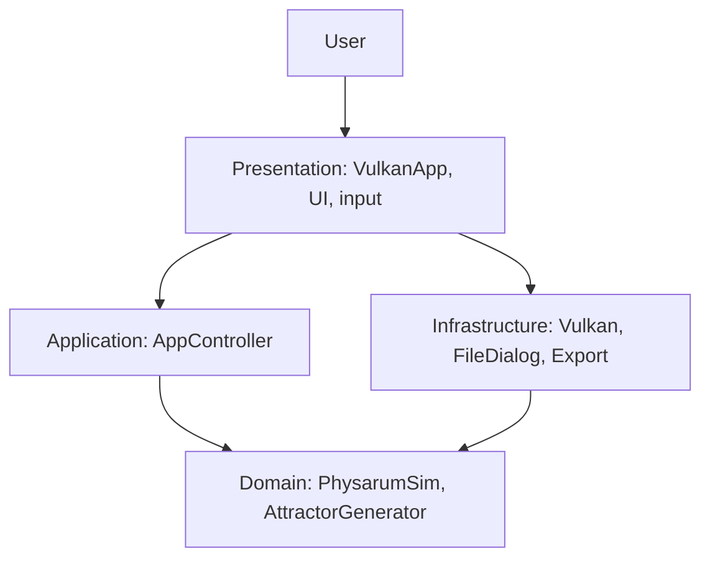
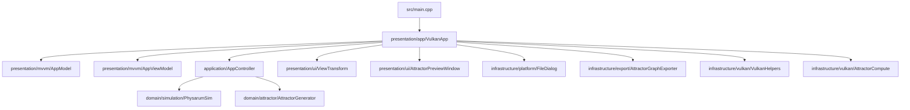
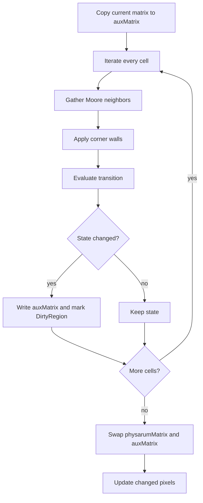

# Architecture

Language: [[Espanol|Arquitectura]] | **English**

This page explains the organization of `PhysarumVulkan`, the current main implementation.

The code is split into layers:

- **domain**: automaton rules and core data;
- **application**: use case coordination;
- **presentation**: window, input, UI, and rendering;
- **infrastructure**: Vulkan, files, export, and technical services.

## Quick view



## Folder structure

```text
PhysarumVulkan/
  CMakeLists.txt
  shaders/
  src/
    main.cpp
    application/
    domain/
      simulation/
      attractor/
    infrastructure/
      export/
      platform/
      vulkan/
    presentation/
      app/
      mvvm/
      ui/
```

## Code diagram



## Entry point

`src/main.cpp`:

1. sanitizes problematic GTK variables when needed;
2. reads `--grid WIDTHxHEIGHT`;
3. creates `VulkanApp` and runs `app.run()`.

## Domain layer

### `PhysarumSim`

Responsibilities:

- store grid size;
- store visible state matrix;
- store memory matrix;
- apply automaton transition rules;
- load image maps when OpenCV is enabled;
- update palette colors;
- calculate changed regions with `DirtyRegion`;
- pack state data for rendering or compute.

Important data:

| Data | Purpose |
| --- | --- |
| `physarumMatrix_` | Current visible state of each cell. |
| `auxMatrix_` | Temporary matrix for the next generation. |
| `memoryMatrix_` | Direction or memory associated with each cell. |
| `rgbaPixels_` | Pixels ready for the visible texture. |
| `dirtyRegion_` | Minimum rectangle changed since last upload. |
| `palette_` | RGBA color of each state. |

### `AttractorGenerator`

Responsibilities:

- generate attractor graphs;
- choose exact or approximate mode;
- use a background worker;
- report progress;
- build radial graph layout;
- preserve approximate continuation for refinement.

## Application layer

`AppController` coordinates higher-level actions so that UI code does not need to know every internal detail of the domain.

## Presentation layer

`VulkanApp` connects:

- GLFW window;
- Vulkan initialization;
- keyboard and mouse events;
- canvas rendering;
- side menu;
- texture uploads;
- attractor window;
- exports.

`ViewTransform` handles conversion between screen, canvas, and cell coordinates, plus zoom and pan.

## Infrastructure layer

- `infrastructure/vulkan`: Vulkan helpers and compute.
- `infrastructure/platform`: file picker.
- `infrastructure/export`: SVG and PNG graph exporters.

## Generation flow



## Dependency rule

Desired direction:

```text
presentation -> application -> domain
presentation -> infrastructure
infrastructure -> domain
```

Avoid:

```text
domain -> presentation
domain -> vulkan
domain -> glfw
domain -> hardware
```

## Where to change things

| Change | File or folder |
| --- | --- |
| Automaton rule | `src/domain/simulation/PhysarumSim.cpp` |
| Default states or palette | `src/domain/simulation/PhysarumSim.cpp` |
| Startup arguments | `src/main.cpp` |
| Keyboard/mouse controls | `src/presentation/app/VulkanApp.cpp` |
| Zoom/pan | `src/presentation/ui/ViewTransform.cpp` |
| Attractor layout | `src/domain/attractor/AttractorGenerator.cpp` |
| SVG/PNG export | `src/infrastructure/export/AttractorGraphExporter.cpp` |
| File loading | `src/infrastructure/platform/FileDialog.cpp` |
| Shaders | `shaders/` |

