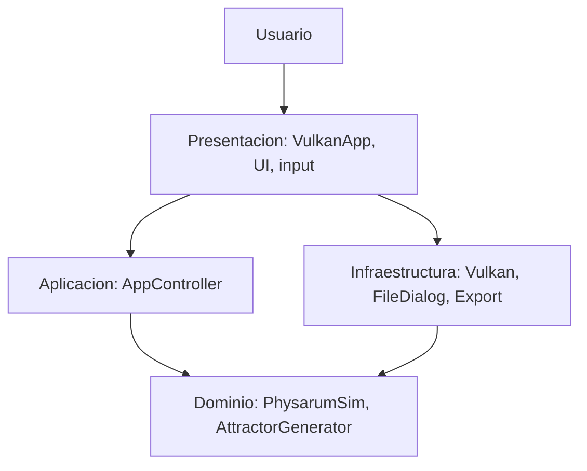
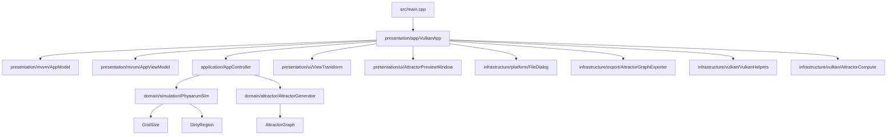
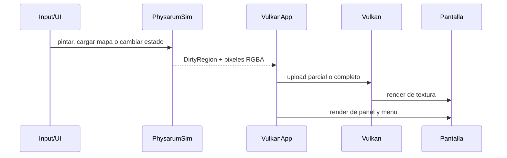
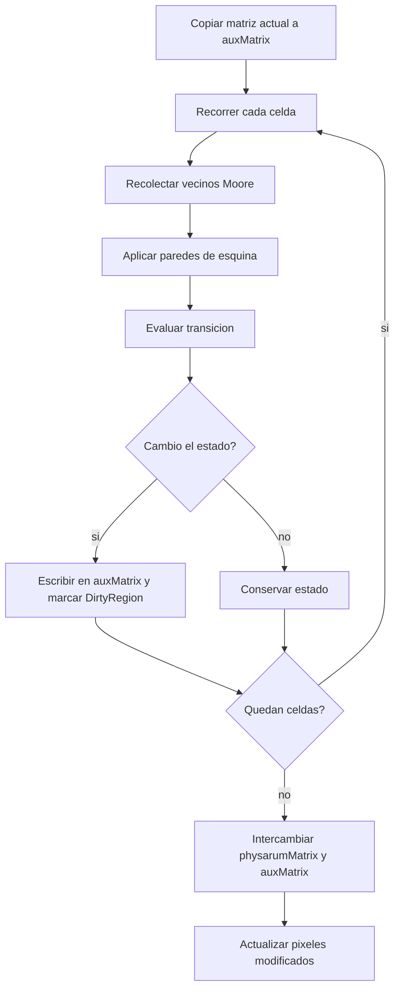

# Arquitectura

Esta pagina explica como esta organizado el codigo de `PhysarumVulkan`, que es la implementacion principal actual.

La idea central es separar el proyecto en capas:

- **dominio**: reglas del automata y datos principales;
- **aplicacion**: coordinacion de casos de uso;
- **presentacion**: ventana, input, interfaz y render;
- **infraestructura**: Vulkan, archivos, exportacion y servicios tecnicos.

## Vista rapida



## Estructura de carpetas

```text
PhysarumVulkan/
  CMakeLists.txt
  shaders/
    attractor.comp
    physarum.comp
    quad.vert
    quad.frag
    rect.vert
    rect.frag
  src/
    main.cpp
    application/
      AppController.h
      AppController.cpp
    domain/
      simulation/
        PhysarumSim.h
        PhysarumSim.cpp
      attractor/
        AttractorGenerator.h
        AttractorGenerator.cpp
    infrastructure/
      export/
        AttractorGraphExporter.h
        AttractorGraphExporter.cpp
      platform/
        FileDialog.h
        FileDialog.cpp
      vulkan/
        AttractorCompute.h
        AttractorCompute.cpp
        VulkanHelpers.h
    presentation/
      app/
        VulkanApp.h
        VulkanApp.cpp
      mvvm/
        AppModel.h
        AppModel.cpp
        AppViewModel.h
        AppViewModel.cpp
      ui/
        AttractorPreviewWindow.h
        AttractorPreviewWindow.cpp
        DrawGeometry.h
        ViewTransform.h
        ViewTransform.cpp
```

## Diagrama del codigo



## Entrada principal

`src/main.cpp` hace tres cosas:

1. limpia variables GTK problematicas cuando el entorno viene de Snap;
2. lee el argumento `--grid WIDTHxHEIGHT`;
3. crea `VulkanApp` y ejecuta `app.run()`.

Ejemplos:

```bash
./PhysarumVulkan
./PhysarumVulkan --grid 512x512
./PhysarumVulkan --grid=1024x1024
```

## Capa de dominio

El dominio es la parte que deberia poder entenderse sin saber de ventanas, GPU o botones.

### `PhysarumSim`

Responsabilidades:

- guardar el tamanio de grilla;
- guardar la matriz de estados visibles;
- guardar la matriz de memoria;
- aplicar las reglas de transicion del automata;
- cargar mapas desde imagen cuando OpenCV esta activo;
- actualizar colores de la paleta;
- calcular regiones modificadas con `DirtyRegion`;
- empaquetar estados para render o compute.

Datos relevantes:

| Dato | Funcion |
| --- | --- |
| `physarumMatrix_` | Estado visible actual de cada celda. |
| `auxMatrix_` | Matriz temporal donde se escribe la siguiente generacion. |
| `memoryMatrix_` | Direccion o memoria asociada a cada celda. |
| `rgbaPixels_` | Pixeles listos para la textura visible. |
| `dirtyRegion_` | Rectangulo minimo que cambio desde el ultimo upload. |
| `palette_` | Color RGBA de cada estado. |

### `AttractorGenerator`

Responsabilidades:

- generar grafos de atractores;
- decidir modo exacto o aproximado;
- usar un worker en segundo plano;
- reportar progreso;
- construir layout radial;
- conservar continuidad para refinamiento aproximado.

## Capa de aplicacion

`AppController` coordina acciones de alto nivel. La idea de esta capa es que la interfaz no tenga que conocer cada detalle interno del dominio.

Ejemplos de acciones que pertenecen a aplicacion:

- cambiar estado seleccionado;
- iniciar o pausar simulacion;
- solicitar carga de mapa;
- iniciar generacion de atractores;
- actualizar colores;
- preparar informacion para la vista.

## Capa de presentacion

### `VulkanApp`

`VulkanApp` es el adaptador principal. Conecta:

- ventana GLFW;
- inicializacion Vulkan;
- eventos de teclado y mouse;
- render del canvas;
- menu lateral;
- uploads de textura;
- ventana de atractores;
- exportaciones.

### `AppModel` y `AppViewModel`

`AppModel` conserva estado de aplicacion. `AppViewModel` prepara datos para mostrar en UI.

Separarlos ayuda a no mezclar el estado interno con el formato de presentacion.

### `ViewTransform`

Controla conversiones entre:

- coordenadas de pantalla;
- coordenadas del canvas;
- coordenadas de celda.

Tambien concentra zoom, pan, suavizado e inercia.

## Capa de infraestructura

### Vulkan

`infrastructure/vulkan` contiene helpers y computo especifico de GPU. El dominio no deberia depender de esta capa.

### Plataforma

`FileDialog` abstrae el selector de archivos. En Linux intenta `zenity`, `kdialog` o `tkinter`.

### Exportacion

`AttractorGraphExporter` guarda grafos de atractores en SVG o PNG.

## Flujo de render



## Flujo de una generacion



## Regla de dependencias

La direccion deseada es:

```text
presentation -> application -> domain
presentation -> infrastructure
infrastructure -> domain
```

Evitar:

```text
domain -> presentation
domain -> vulkan
domain -> glfw
domain -> hardware
```

Esto permite probar y evolucionar el automata sin arrastrar dependencias de ventana, GPU o robot.

## Donde cambiar cada cosa

| Cambio que quieres hacer | Archivo o carpeta |
| --- | --- |
| Cambiar regla del automata | `src/domain/simulation/PhysarumSim.cpp` |
| Cambiar estados o paleta por defecto | `src/domain/simulation/PhysarumSim.cpp` |
| Cambiar argumentos de arranque | `src/main.cpp` |
| Cambiar controles de teclado/mouse | `src/presentation/app/VulkanApp.cpp` |
| Cambiar zoom/pan | `src/presentation/ui/ViewTransform.cpp` |
| Cambiar layout de atractores | `src/domain/attractor/AttractorGenerator.cpp` |
| Cambiar exportacion SVG/PNG | `src/infrastructure/export/AttractorGraphExporter.cpp` |
| Cambiar carga de archivos | `src/infrastructure/platform/FileDialog.cpp` |
| Cambiar shaders | `shaders/` |

