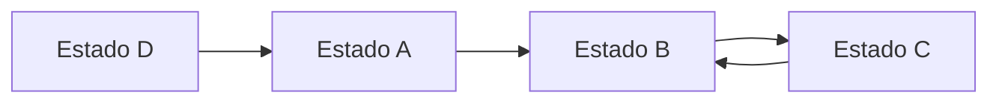
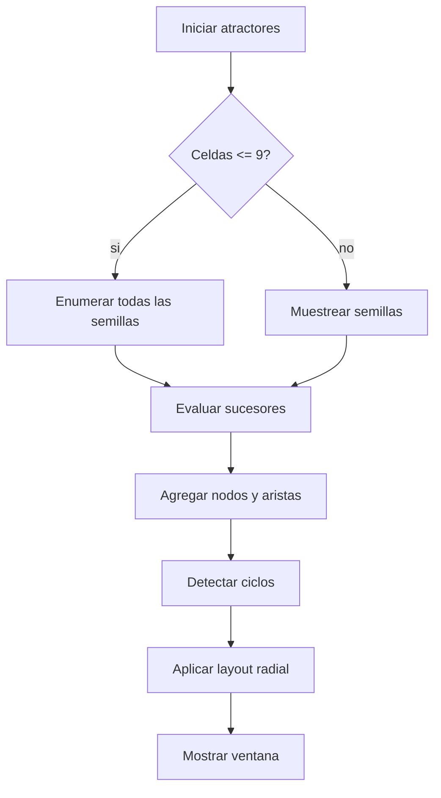
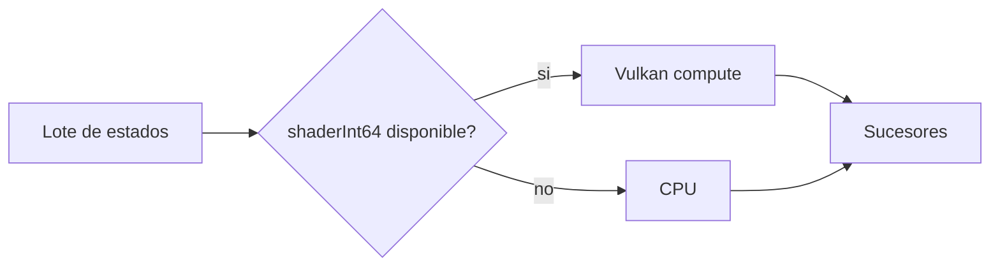

# Atractores

Los atractores ayudan a estudiar el comportamiento del automata en subrejillas pequenas. Esta parte no es necesaria para usar el simulador basico, pero es util para analizar ciclos, estados recurrentes y estabilidad.

## Que es un atractor

Un atractor es una configuracion, o conjunto de configuraciones, hacia la que el sistema tiende despues de aplicar repetidamente la regla de transicion.

En esta implementacion:

- cada nodo es una configuracion de una subrejilla;
- cada arista apunta al sucesor de esa configuracion;
- los ciclos representan comportamientos recurrentes.



En el ejemplo, `B` y `C` forman un ciclo. `A` y `D` son estados que terminan llegando a ese ciclo.

## Por que se usa una regla determinista

La simulacion normal usa direccion pseudoaleatoria para imitar una expansion organica. Pero para construir un grafo, cada estado necesita tener siempre el mismo sucesor.

Por eso el generador de atractores usa una version determinista de la regla:

- la configuracion se codifica;
- se calcula una direccion reproducible a partir del estado;
- se aplica la misma logica de transicion;
- se obtiene siempre el mismo sucesor para la misma entrada.

## Modo exacto

El modo exacto se usa cuando la subrejilla tiene hasta `9` celdas.

```text
1x1 = 1 celda
2x2 = 4 celdas
3x3 = 9 celdas
```

En este modo se enumeran todas las semillas posibles usando los nueve estados visibles por celda.

El espacio crece asi:

| Subrejilla | Celdas | Estados visibles posibles |
| --- | --- | --- |
| `1x1` | 1 | `9^1` |
| `2x2` | 4 | `9^4` |
| `3x3` | 9 | `9^9` |

## Modo aproximado

Para mas de `9` celdas se usa muestreo aproximado. En lugar de recorrer todo el espacio, el sistema toma muestras y construye el grafo con los nodos descubiertos.

El boton **REFINAR** agrega otro bloque de muestras sobre el mismo grafo.



## Evaluacion por CPU o GPU

Cuando la GPU soporta `shaderInt64`, la evaluacion de sucesores puede hacerse por lotes con Vulkan compute. Si no, el sistema usa CPU.



## Layout del grafo

El grafo se organiza con layout radial:

- ciclos al centro de cada componente;
- arboles entrantes alrededor del ciclo;
- componentes separados segun masa y profundidad;
- nodos mas visitados con mayor influencia visual.

La ventana dedicada usa:

- cian para transiciones;
- magenta para nodos;
- dorado para ciclos.

## Exportacion

El ultimo grafo generado puede exportarse como:

- `SVG`: vectorial, recomendado para documentos y escalado.
- `PNG`: raster, requiere OpenCV.

## Interpretacion de contadores

| Indicador | Significado |
| --- | --- |
| `SEM` | Semillas exactas o muestras procesadas. |
| `NOD` | Nodos descubiertos. |
| `MODO EXACTO` | Enumeracion completa. |
| `MODO APROX` | Muestreo progresivo. |

## Recomendaciones

- Empieza con `2x2`.
- Usa `3x3` solo si necesitas mas detalle.
- Para `4x4` o mas, asume que sera aproximado.
- Exporta SVG para incluirlo en reportes o presentaciones.

