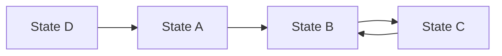
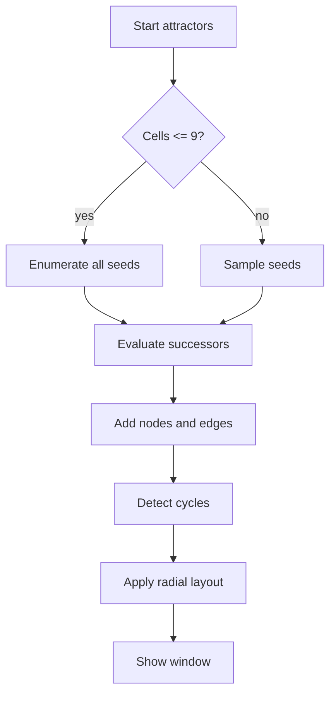

# Attractors

Language: [[Espanol|Atractores]] | **English**

Attractors help study the automaton behavior in small subgrids. This is not required for basic simulator use, but it is useful for analyzing cycles, recurrent states, and stability.

## What an attractor is

An attractor is a configuration, or set of configurations, that the system tends to reach after repeatedly applying the transition rule.

In this implementation:

- each node is a subgrid configuration;
- each edge points to the successor of that configuration;
- cycles represent recurrent behavior.



## Why a deterministic rule is used

Normal simulation uses pseudo-random direction to imitate organic expansion. But graph construction requires every state to always have the same successor.

The attractor generator therefore uses a deterministic version of the rule.

## Exact mode

Exact mode is used when the subgrid has up to `9` cells:

```text
1x1 = 1 cell
2x2 = 4 cells
3x3 = 9 cells
```

It enumerates all possible seeds using the nine visible states per cell.

| Subgrid | Cells | Visible state combinations |
| --- | --- | --- |
| `1x1` | 1 | `9^1` |
| `2x2` | 4 | `9^4` |
| `3x3` | 9 | `9^9` |

## Approximate mode

For more than `9` cells, approximate sampling is used. Instead of traversing the full state space, the system samples states and builds a graph with discovered nodes.

The **REFINAR** button adds another sample block to the same graph.



## CPU or GPU evaluation

When the GPU supports `shaderInt64`, successor evaluation can run in Vulkan compute batches. Otherwise, CPU is used.

## Graph layout

The graph uses radial layout:

- cycles at the center of each component;
- incoming trees around cycles;
- components separated by mass and depth;
- more visited nodes have more visual influence.

The dedicated window uses:

- cyan for transitions;
- magenta for nodes;
- gold for cycles.

## Export

The last generated graph can be exported as:

- `SVG`: vector output, recommended for documents and scaling.
- `PNG`: raster output, requires OpenCV.

## Counters

| Indicator | Meaning |
| --- | --- |
| `SEM` | Exact seeds or processed samples. |
| `NOD` | Discovered nodes. |
| `MODO EXACTO` | Complete enumeration. |
| `MODO APROX` | Progressive sampling. |

