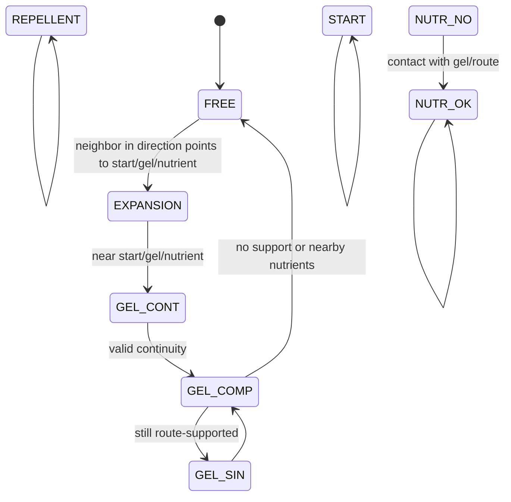

# Automaton Model

Language: [[Espanol|Modelo-del-automata]] | **English**

This page describes the model used by the simulator. If you are new to cellular automata, read [[Basic-Concepts]] first.

## Informal definition

The simulator represents the world as a grid. Each cell has a state. At each generation, each cell reads its neighbors and decides its next state.

The behavior is inspired by *Physarum polycephalum*: it expands while searching for nutrients and then consolidates a route.

## Formal definition

The automaton can be seen as:

```text
(Z^2, S, N, f)
```

Where:

- `Z^2` is the two-dimensional coordinate space `(x, y)`;
- `S = {0,1,2,3,4,5,6,7,8}` is the finite state set;
- `N` is the Moore neighborhood;
- `f` is the local transition function.

Each cell is evaluated with:

```text
P = (C(x, y, t), N(x, y, t), M(x, y, t))
```

Where:

- `C` is the current central cell state;
- `N` is the neighbor state set;
- `M` is the cell direction memory;
- `t` is the current generation.

## Moore neighborhood

```text
NW  N  NE
 W  C   E
SW  S  SE
```

Internal offset order:

```text
0: W
1: SW
2: S
3: SE
4: E
5: NE
6: N
7: NW
```

## States

| State | UI name | Meaning for new users | Rule role |
| --- | --- | --- | --- |
| `0` | `LIBRE` | Available space. | Can become expansion. |
| `1` | `NUTR NO` | Nutrient not found. | Pending destination. |
| `2` | `REPELENTE` | Obstacle, wall, or boundary. | Blocks growth. |
| `3` | `INICIO` | Physarum origin. | Initial expansion source. |
| `4` | `GEL CONT` | Contracting or connecting gel. | Intermediate toward consolidation. |
| `5` | `GEL COMP` | Consolidated gel. | Stable route segment. |
| `6` | `NUTR OK` | Nutrient found. | Reached destination. |
| `7` | `EXPANSION` | Growth front. | Converts into contact gel. |
| `8` | `GEL SIN` | Transitional gel. | Returns to compound gel. |

## General route cycle



## Rule summary

| Current state | Condition | Next state |
| --- | --- | --- |
| `0 FREE` | `START`, `GEL CONT`, or `NUTR OK` exists in a chosen direction and memory is `0`. | `7 EXPANSION` |
| `1 NUTR NO` | `GEL COMP` or `NUTR OK` exists nearby. | `6 NUTR OK` |
| `2 REPELLENT` | Always. | `2 REPELLENT` |
| `3 START` | Always. | `3 START` |
| `4 GEL CONT` | Continuity toward `START`, `GEL COMP`, or `NUTR OK`, no free/expansion around, no previous memory. | `5 GEL COMP` |
| `5 GEL COMP` | No longer supported by memory or key states. | `0 FREE` |
| `5 GEL COMP` | Release condition is not met. | `8 GEL SIN` |
| `6 NUTR OK` | Always. | `6 NUTR OK` |
| `7 EXPANSION` | `START`, `GEL CONT`, or `NUTR OK` exists nearby. | `4 GEL CONT` |
| `8 GEL SIN` | Always. | `5 GEL COMP` |

## Direction memory

The memory matrix stores a direction from `1` to `8` when a cell consolidates. This lets the route verify continuity in later generations.

When a cell returns to `FREE`, its memory is cleared.

## Corners and imaginary repellents

With Moore neighborhoods, a cell could cross a diagonal corner even if two orthogonal walls block the path. To prevent this, the rule treats the diagonal as a wall when two repellents form a corner.

```text
R  X
C  R

R = real repellent
C = central cell
X = diagonal corner treated as repellent
```

## Pseudocode

```text
for each generation:
    auxMatrix = physarumMatrix

    for each cell (x, y):
        neighbors = gather Moore neighbors
        memory_neighbors = gather neighbor memory
        apply corner walls
        choose pseudo-random direction
        evaluate transition rule
        write changes to auxMatrix
        register dirty region

    physarumMatrix = auxMatrix
    update pixels for changed region
```

## Route completion

The simulator observes:

- how many nutrients remain as `NUTR NO`;
- how many nutrients are already `NUTR OK`;
- how many Physarum cells are active;
- whether the gel amount stabilizes.

When no nutrients remain unfound and the structure stabilizes for several generations, the route is marked as complete.

## Normal simulation vs attractors

Normal simulation uses pseudo-random direction to simulate organic expansion.

Attractor exploration uses a deterministic direction based on the state. This is required because an attractor graph needs each configuration to always have the same successor.

