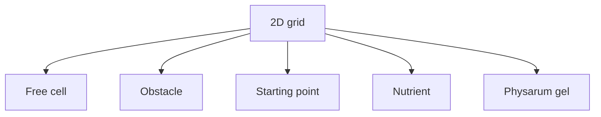
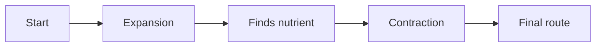

# Basic Concepts

Language: [[Espanol|Conceptos-basicos]] | **English**

This page explains the project from zero.

## What is a cellular automaton

A cellular automaton is a system made of many cells. Each cell has a state and changes over time by applying simple rules over its neighbors.

Example:

- a cell can be free or occupied;
- at each step it reads nearby cells;
- depending on what it finds, it changes or keeps its state.

Even when each cell follows a local rule, the full system can produce complex behavior: paths, patterns, growth, dispersion, and stability.

## What is Physarum polycephalum

*Physarum polycephalum* is a biological organism that can extend as a network to search for food. It is relevant in computing because it has inspired routing, optimization, and transport network models.

The project uses this idea:

```text
when the organism finds food, it reinforces useful paths
and reduces paths that are no longer useful.
```

In the simulator, that idea becomes a grid with states.

## What the grid represents

The grid is the map of the world. Each cell represents a small part of the space.



If the map is `200x200`, there are 40,000 cells. If it is `1000x1000`, there are 1,000,000 cells.

## What solving a route means

Solving a route means that the automaton starts from a point, expands through free space, detects nutrients, and then keeps a path structure between origin and destination.



## What a state is

A state is the value stored by a cell. This project uses nine main states:

- free;
- nutrient not found;
- repellent or obstacle;
- starting point;
- gel and expansion states;
- nutrient found.

The [[Automaton-Model]] page explains every state and rule.

## Moore neighborhood

The Moore neighborhood is the set of eight cells around a central cell.

```text
NW  N  NE
 W  C   E
SW  S  SE
```

The automaton reads those neighbors to decide what happens in the next generation.

## Generation

A generation is one time step. In each generation:

1. the current state of every cell is read;
2. neighbors are read;
3. the transition rule is applied;
4. a new grid is produced.

## Vulkan's role

Vulkan displays the simulation efficiently. The simulation stores cell data and the renderer converts that data into visible pixels.

You do not need to know Vulkan to use the simulator. If you will modify rendering or textures, read [[Architecture-English]].

## Robot role

The academic document proposes that the route generated by the simulator can guide a Raspberry Pi robot. The robot would collect sensor data, avoid obstacles, and send information to a monitoring server or application.

In the current repository, that work lives as tests and prototypes inside `HardwareTests`.

