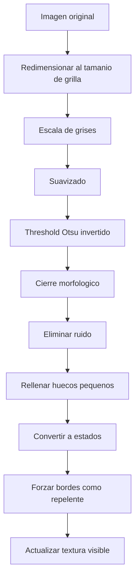
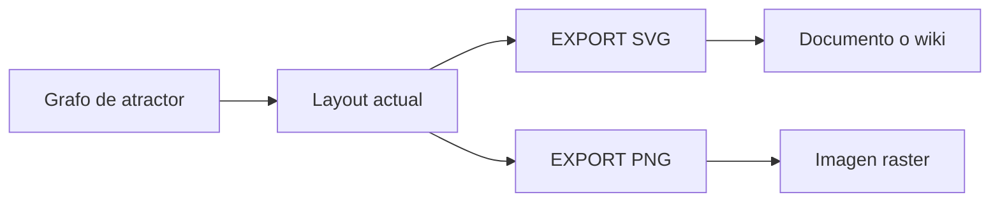

# Carga de mapas y exportacion

Esta pagina explica como el simulador convierte imagenes en mapas de celdas y como exporta resultados de atractores.

## Para que sirve cargar mapas

La carga de mapas permite usar una imagen como entorno inicial. Las zonas detectadas como obstaculos se convierten en `REPELENTE` y el resto se conserva como espacio `LIBRE`.

Despues de cargar el mapa, el usuario coloca:

- `INICIO`: punto de salida;
- `NUTR NO`: destino o punto de interes;
- otros `REPELENTE` si quiere ajustar paredes manualmente.

## Flujo de carga

## Pipeline tecnico

El boton **CARGAR MAPA** abre un selector de archivos. La imagen se procesa con OpenCV cuando la build lo incluye.

Pasos:

1. leer imagen en color;
2. redimensionar al tamanio actual de grilla;
3. convertir a escala de grises;
4. suavizar con Gaussian blur;
5. aplicar threshold automatico Otsu con inversion;
6. cerrar morfologicamente la mascara;
7. eliminar componentes pequenos;
8. rellenar huecos interiores pequenos;
9. convertir obstaculos a estado `2`;
10. forzar los bordes externos como estado `2`.

## Interpretacion de colores en imagenes

El sistema no lee significado semantico de la imagen. Solo procesa contraste:

- zonas oscuras tienden a convertirse en obstaculos;
- zonas claras tienden a convertirse en espacio libre;
- imagenes con poco contraste pueden generar mapas pobres.

Para mejores resultados:

- usa mapas de alto contraste;
- evita fondos con ruido;
- limpia texto o marcas innecesarias;
- prueba primero con grillas medianas como `512x512`.

## Parametros adaptativos

El tamanio del kernel y los filtros de area se adaptan al tamanio de la grilla.

| Funcion | Idea |
| --- | --- |
| `denoiseKernelSize` | Usa kernel mayor en grillas grandes. |
| `minimumObstacleArea` | Elimina manchas pequenas. |
| `maximumHoleArea` | Rellena huecos interiores pequenos. |

## Exportacion de atractores

Despues de generar un grafo de atractores:

- **EXPORT SVG** guarda una version vectorial del grafo.
- **EXPORT PNG** guarda una imagen raster si OpenCV esta activo.

El SVG es la salida recomendada para reportes porque escala sin perdida.

## Flujo de exportacion

## Limitaciones

- La carga de imagen depende de OpenCV.
- La exportacion PNG depende de OpenCV.
- El threshold automatico puede requerir preparar la imagen antes.
- Una grilla muy grande aumenta memoria y tiempo de proceso.
- El modo exacto de atractores crece rapidamente con el tamanio de subrejilla.

