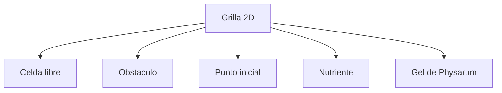
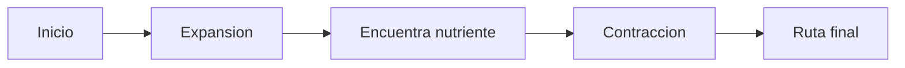

# Conceptos basicos

Esta pagina explica el proyecto desde cero.

## Que es un automata celular

Un automata celular es un sistema formado por muchas celdas. Cada celda tiene un estado y cambia con el tiempo aplicando reglas simples sobre sus vecinos.

Ejemplo simple:

- una celda puede estar libre u ocupada;
- en cada paso mira las celdas cercanas;
- segun lo que encuentre, cambia o conserva su estado.

Aunque cada celda toma decisiones locales, el conjunto puede producir comportamientos complejos: rutas, patrones, crecimiento, dispersion o estabilidad.

## Que es Physarum polycephalum

*Physarum polycephalum* es un organismo biologico que puede extenderse como una red para buscar alimento. Es interesante en computacion porque ha sido usado como inspiracion para problemas de ruteo, optimizacion y redes de transporte.

La idea que aprovecha este proyecto es:

```text
si el organismo encuentra alimento, refuerza las conexiones utiles
y elimina o reduce caminos que ya no sirven.
```

En el simulador, esa idea se traduce a una grilla con estados.

## Que representa la grilla

La grilla es el mapa del mundo. Cada celda representa una pequena parte del espacio.



Si el mapa mide `200x200`, hay 40,000 celdas. Si mide `1000x1000`, hay 1,000,000 celdas.

## Que significa resolver una ruta

Resolver una ruta significa que el automata inicia desde un punto, se expande por el espacio libre, detecta nutrientes y despues conserva una estructura de camino entre origen y destino.



## Que es un estado

Un estado es el valor que tiene una celda. En este proyecto hay nueve estados principales:

- libre;
- nutriente no encontrado;
- repelente u obstaculo;
- punto inicial;
- estados de gel y expansion;
- nutriente encontrado.

La pagina [[Modelo-del-automata]] explica cada estado y sus reglas.

## Que es la vecindad de Moore

La vecindad de Moore son las ocho celdas que rodean a una celda central.

```text
NW  N  NE
 W  C   E
SW  S  SE
```

El automata revisa esos vecinos para decidir que pasa en la siguiente generacion.

## Que es una generacion

Una generacion es un paso de tiempo. En cada generacion:

1. se revisa el estado actual de cada celda;
2. se revisan sus vecinos;
3. se aplica la regla de transicion;
4. se produce una nueva grilla.

## Que papel tiene Vulkan

Vulkan se usa para mostrar la simulacion de forma eficiente. La simulacion mantiene datos de celdas y el render convierte esos datos en pixeles visibles.

No necesitas saber Vulkan para usar el simulador. Si vas a modificar el render o la textura, revisa [[Arquitectura]].

## Que papel tiene el robot

El documento academico plantea que la ruta generada por el simulador puede servir para guiar un robot con Raspberry Pi. El robot recolectaria datos con sensores, evitaria obstaculos y enviaria informacion a un servidor o aplicacion de monitoreo.

En el repositorio actual, esa parte vive como pruebas y prototipos en `HardwareTests`.

