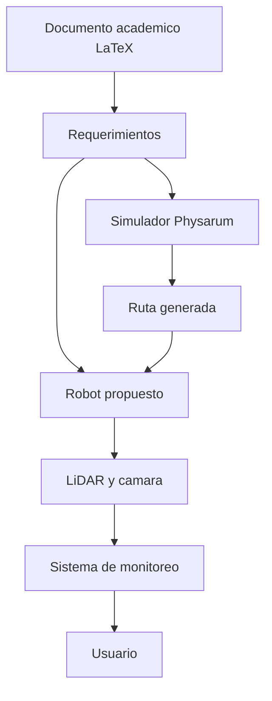
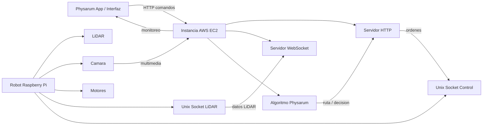
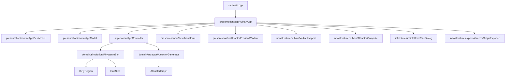
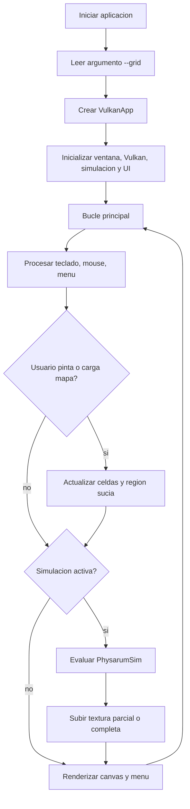
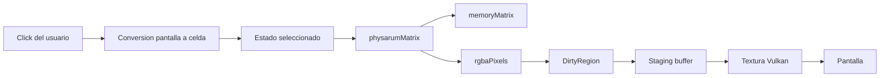
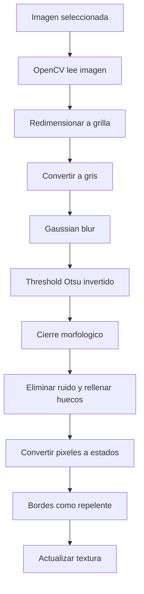
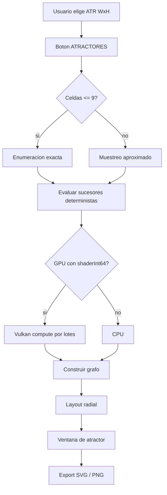
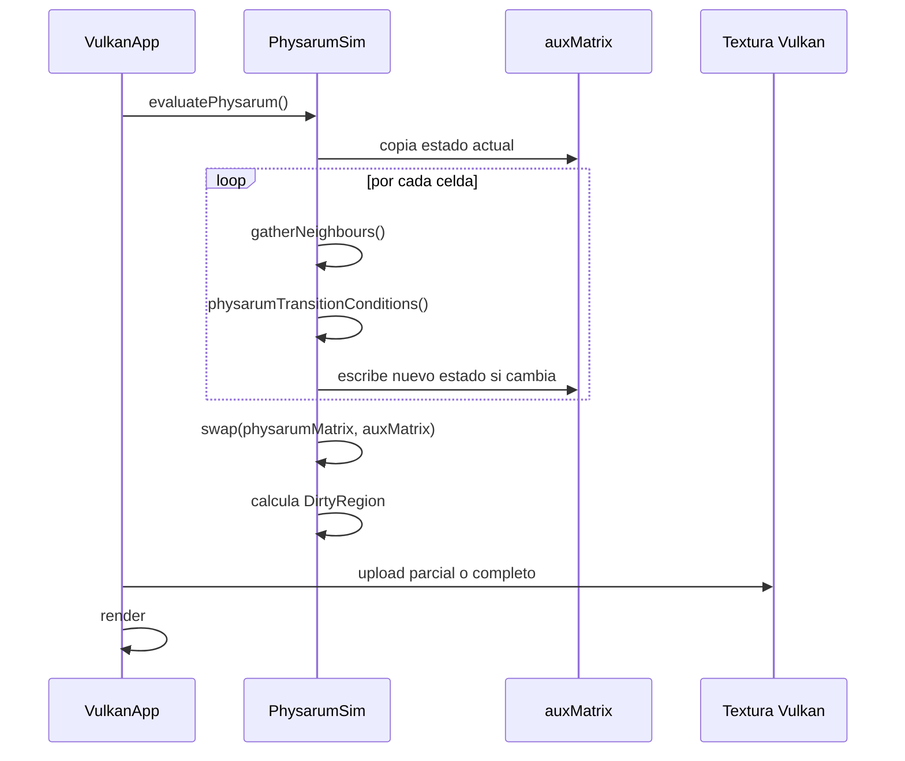

# Diagramas del sistema

Esta pagina concentra los diagramas principales. Estan escritos en Mermaid para que GitHub Wiki los renderice directamente.

## Vista general del proyecto

## Arquitectura distribuida propuesta

## Arquitectura del codigo actual

## Flujo de ejecucion del simulador

## Flujo de datos de una celda

## Flujo de carga de mapa

## Flujo de atractores

## Secuencia de una generacion

