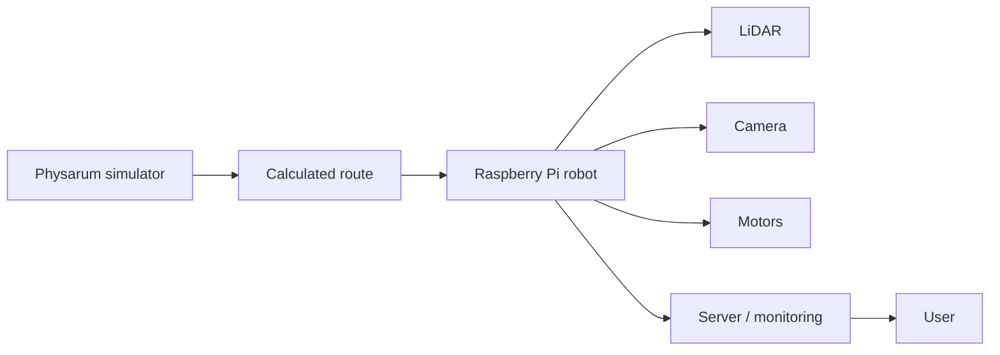
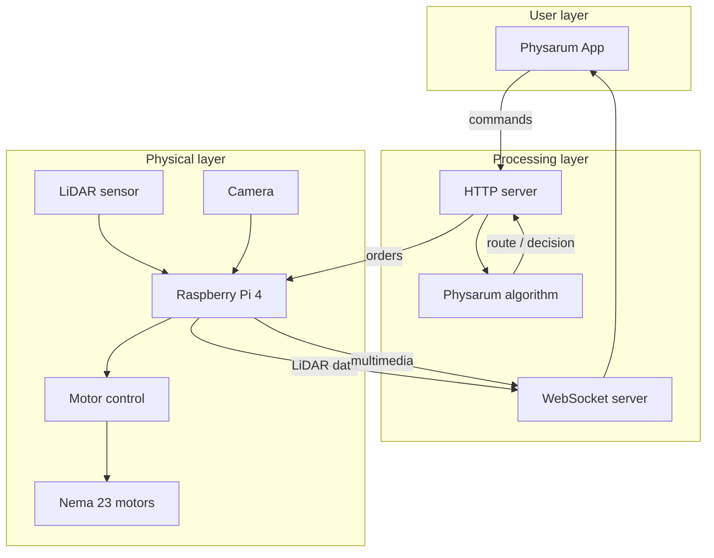

# Hardware and Communication

Language: [[Espanol|Hardware-y-comunicacion]] | **English**

The `HardwareTests` directory groups experimental tests for sensors, motors, and servers. It is not part of the main `PhysarumVulkan` binary, but documents the robotics integration line proposed in the terminal project.

## Robotic system idea

The academic document proposes a system where the simulator calculates routes and a Raspberry Pi robot collects environment information.



## Proposed distributed architecture

The LaTeX document describes three layers:

- user application/interface;
- cloud or intermediate server;
- physical robot with sensors and control.



## Proposed hardware components

| Component | Function |
| --- | --- |
| Raspberry Pi 4 B | Main robot controller. |
| DTOF STL27L LiDAR | Obstacle detection and distance measurement. |
| 5MP infrared night camera | Remote vision and monitoring. |
| Nema 23 motors | Precise movement. |
| Stepper motor drivers | Motor electrical control. |
| Omnidirectional wheels | Multi-directional movement. |
| 12V 20000mAh batteries | Power supply. |
| Boost Buck converter | Voltage regulation. |
| Aluminum/acrylic structure | Mechanical support. |

## Directory areas

```text
HardwareTests/
  KinnectAndLiDAR/
  RobotCode/
  Servers/
  Tests/
```

## LiDAR and Kinect

`KinnectAndLiDAR` contains LiDAR, socket, and utility tests.

`Tests/LiDAR` includes:

- `ILidar` interface;
- `RealLidar` implementation;
- mock-based tests;
- CMake with `ydlidar_sdk`, SFML, and OpenCV dependencies.

## Motors

`Tests/Motors` contains unit tests for motor control, including a `pigpio` mock. This allows logic validation without real hardware.

## Servers

`Servers` contains HTTP and WebSocket prototypes:

- `CommandServers`: experimental command server.
- `LidarServers`: Node.js WebSocket server based on `ws`.
- `ServerDiscontinued`: older Java/UDP/TCP implementations.

Install WebSocket server dependencies:

```bash
cd HardwareTests/Servers/LidarServers
npm install
```

## Recommended integration with `PhysarumVulkan`

The ideal integration should not make `PhysarumSim` depend on hardware. Use adapters:


