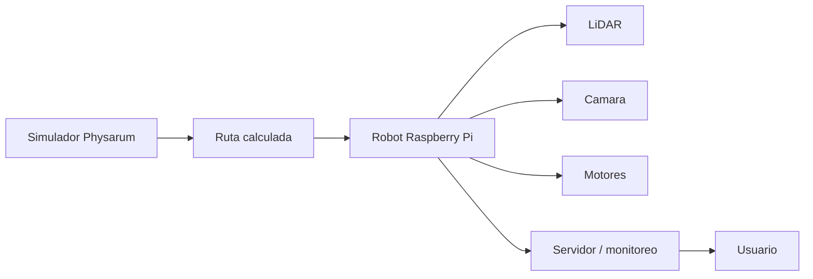
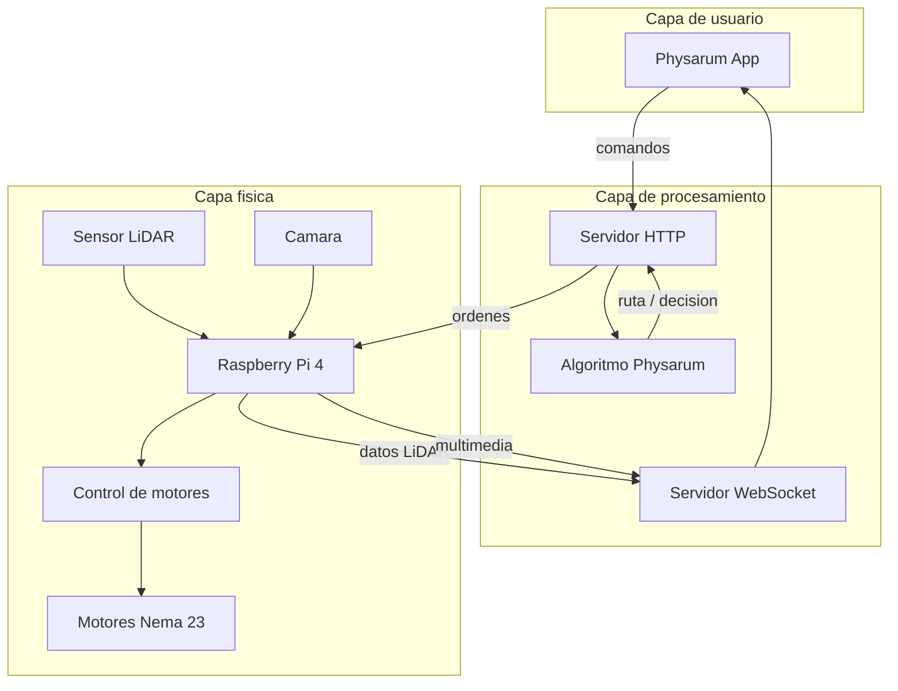
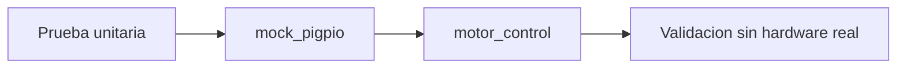
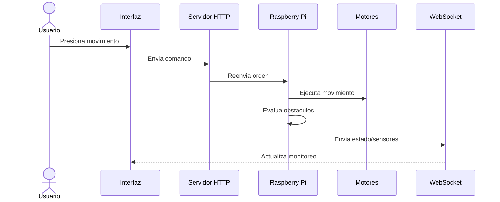
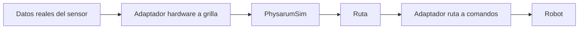

# Hardware y comunicacion

El directorio `HardwareTests` agrupa pruebas experimentales para sensores, motores y servidores. No forma parte del binario principal `PhysarumVulkan`, pero documenta la linea de integracion con robotica planteada en el Trabajo Terminal.

## Idea del sistema robotico

El documento academico propone un sistema donde el simulador calcula rutas y un robot con Raspberry Pi recolecta informacion del entorno.



## Arquitectura distribuida propuesta

La arquitectura descrita en LaTeX usa tres capas:

- aplicacion o interfaz de usuario;
- servidor en la nube o intermediario;
- robot fisico con sensores y control.



## Componentes de hardware propuestos

| Componente | Funcion |
| --- | --- |
| Raspberry Pi 4 B | Controlador principal del robot. |
| LiDAR DTOF STL27L | Deteccion de obstaculos y medicion de distancias. |
| Camara nocturna infrarroja 5MP | Vision y monitoreo remoto. |
| Motores Nema 23 | Movimiento preciso. |
| Controladores de motor a pasos | Control electrico de motores. |
| Ruedas omnidireccionales | Movimiento en multiples direcciones. |
| Baterias 12V 20000mAh | Alimentacion. |
| Convertidor Boost Buck | Regulacion de voltaje. |
| Estructura aluminio/acrilico | Soporte mecanico. |

## Areas del directorio

```text
HardwareTests/
  KinnectAndLiDAR/
  RobotCode/
  Servers/
  Tests/
```

## LiDAR y Kinect

`KinnectAndLiDAR` contiene pruebas con LiDAR, sockets y utilidades. Hay CMake, pruebas con Google Test y ejemplos de comunicacion.

`Tests/LiDAR` contiene una estructura mas orientada a pruebas:

- interfaz `ILidar`;
- implementacion `RealLidar`;
- pruebas con mocks;
- CMake con dependencias de `ydlidar_sdk`, SFML y OpenCV.

## Motores

`Tests/Motors` contiene pruebas unitarias para control de motores, incluyendo un mock de `pigpio`. Esto permite validar logica sin depender directamente del hardware real.



## Servidores

`Servers` contiene prototipos HTTP y WebSocket:

- `CommandServers`: servidor de comandos experimental.
- `LidarServers`: servidor WebSocket basado en Node.js y `ws`.
- `ServerDiscontinued`: implementaciones Java/UDP/TCP antiguas.

Para instalar dependencias del servidor WebSocket:

```bash
cd HardwareTests/Servers/LidarServers
npm install
```

## Flujo de control remoto



## Dependencias comunes

Las pruebas de hardware pueden requerir:

- `ydlidar_sdk`;
- SFML;
- OpenCV;
- libusb;
- libfreenect;
- Boost;
- Google Test / Google Mock;
- Node.js para servidores WebSocket.

## Relacion con `PhysarumVulkan`

La integracion ideal no deberia hacer que `PhysarumSim` dependa del hardware. La ruta recomendada es crear adaptadores:



Asi el dominio sigue siendo portable y se puede probar sin tener el robot conectado.

