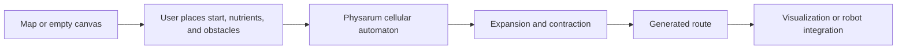

# Physarum Automata

Language: [[Espanol|Home]] | **English**

Welcome to the complete **Physarum Automata** project wiki.

This wiki is written for two kinds of readers:

- people who are new to the project and need to understand what it solves;
- people who will compile, maintain, or extend the codebase.

The repository contains a cellular automaton simulator inspired by *Physarum polycephalum*, hardware prototypes, sensor communication tests, and academic documentation for the terminal project.

## Short summary

The project implements an automaton capable of determining paths in two-dimensional spaces for monitoring and routing in real time. The biological idea comes from *Physarum polycephalum*, an organism capable of forming networks and finding efficient paths toward food sources.

In the software, the environment is represented as a grid. Each cell can be free space, obstacle, starting point, nutrient, or part of the Physarum growth. When the simulation runs, local automaton rules produce a route between the start and the nutrients.

## Repository contents

| Folder | Purpose |
| --- | --- |
| `PhysarumVulkan` | Current C++20 simulator with Vulkan, GLFW, shaders, maps, and attractors. |
| `Physarum-GUI` | Historical SFML and ImGui implementation. |
| `Unconventional-Comp-Physarum` | Earlier SFML prototype. |
| `HardwareTests` | LiDAR, motor, Kinect, server, and communication tests. |
| `PhysarumDocument` | Academic terminal project document in LaTeX. |
| `PhysarumArticle1` | Academic article in LaTeX. |
| `wiki` | Versioned source of this GitHub Wiki. |

## Recommended reading path

If you are new to the project:

1. [[Basic-Concepts]]
2. [[Project-Vision]]
3. [[User-Guide]]
4. [[Automaton-Model]]
5. [[System-Diagrams]]

If you will compile or program:

1. [[Installation-and-Build]]
2. [[Architecture-English]]
3. [[Automaton-Model]]
4. [[Attractors]]
5. [[Testing-and-Validation]]

If you will document or deliver the project:

1. [[Requirements-and-Use-Cases]]
2. [[Hardware-and-Communication]]
3. [[Roadmap-and-Maintenance]]
4. [[Publishing-to-GitHub-Wiki]]

## Current state

The Vulkan version includes:

- main render through an `R8G8B8A8_UNORM` texture;
- canvas zoom and pan;
- side menu for states, colors, maps, and attractors;
- dynamic grid size changes;
- image map loading with OpenCV;
- attractor export to SVG and PNG;
- exact attractor evaluation for small subgrids and approximate exploration for larger spaces;
- code separation by domain, application, presentation, and infrastructure layers.

## Full wiki map

- [[Basic-Concepts]]
- [[Project-Vision]]
- [[Requirements-and-Use-Cases]]
- [[Installation-and-Build]]
- [[User-Guide]]
- [[Architecture-English]]
- [[System-Diagrams]]
- [[Automaton-Model]]
- [[Attractors]]
- [[Map-Loading-and-Export]]
- [[Hardware-and-Communication]]
- [[Testing-and-Validation]]
- [[Roadmap-and-Maintenance]]
- [[Publishing-to-GitHub-Wiki]]

