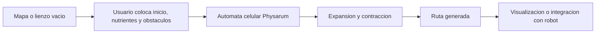

# Physarum Automata

Bienvenido a la wiki completa del proyecto **Physarum Automata**.

Language: **Espanol** | [[English|Home-English]]

Esta wiki esta escrita para dos tipos de lector:

- alguien que no conoce el proyecto y necesita entender que problema resuelve;
- alguien que va a compilar, mantener o extender el codigo.

El repositorio contiene un simulador de automatas celulares inspirado en *Physarum polycephalum*, prototipos de hardware, pruebas de comunicacion con sensores y documentos academicos del Trabajo Terminal.

## Resumen corto

El proyecto busca implementar un automata capaz de determinar trayectos en espacios bidimensionales para monitoreo y ruteo en tiempo real. La idea biologica viene de *Physarum polycephalum*, un organismo capaz de formar redes y encontrar caminos eficientes hacia fuentes de alimento.

En el software, el entorno se representa como una grilla. Cada celda puede ser espacio libre, obstaculo, punto inicial, nutriente o parte del crecimiento del Physarum. Al ejecutar la simulacion, las reglas locales del automata producen una ruta entre el inicio y los nutrientes.

## Que contiene este repositorio

| Carpeta | Para que sirve |
| --- | --- |
| `PhysarumVulkan` | Simulador actual en C++20 con Vulkan, GLFW, shaders, mapas y atractores. |
| `Physarum-GUI` | Version historica con SFML e ImGui. |
| `Unconventional-Comp-Physarum` | Prototipo SFML anterior. |
| `HardwareTests` | Pruebas de LiDAR, motores, Kinect, servidores y comunicacion. |
| `PhysarumDocument` | Documento academico del Trabajo Terminal en LaTeX. |
| `PhysarumArticle1` | Articulo academico en LaTeX. |
| `wiki` | Fuente versionada de esta Wiki de GitHub. |

## Ruta recomendada de lectura

Si no sabes nada del proyecto:

1. [[Conceptos-basicos]]
2. [[Vision-del-proyecto]]
3. [[Guia-de-uso]]
4. [[Modelo-del-automata]]
5. [[Diagramas-del-sistema]]

Si vas a compilar o programar:

1. [[Instalacion-y-build]]
2. [[Arquitectura]]
3. [[Modelo-del-automata]]
4. [[Atractores]]
5. [[Pruebas-y-validacion]]

Si vas a documentar o entregar:

1. [[Requerimientos-y-casos-de-uso]]
2. [[Hardware-y-comunicacion]]
3. [[Roadmap-y-mantenimiento]]
4. [[Publicar-en-GitHub-Wiki]]

## Estado actual

La version Vulkan ya incluye:

- render principal sobre textura `R8G8B8A8_UNORM`;
- canvas con zoom y desplazamiento;
- menu lateral para estados, colores, mapas y atractores;
- cambio dinamico de tamanio de grilla;
- carga de mapas desde imagen con OpenCV;
- exportacion de atractores a SVG y PNG;
- evaluacion de atractores exacta para subrejillas pequenas y aproximada para espacios mayores;
- separacion de codigo por dominio, aplicacion, presentacion e infraestructura.

## Mapa completo de la wiki

### Espanol

- [[Conceptos-basicos]]
- [[Vision-del-proyecto]]
- [[Requerimientos-y-casos-de-uso]]
- [[Instalacion-y-build]]
- [[Guia-de-uso]]
- [[Arquitectura]]
- [[Diagramas-del-sistema]]
- [[Modelo-del-automata]]
- [[Atractores]]
- [[Carga-de-mapas-y-exportacion]]
- [[Hardware-y-comunicacion]]
- [[Pruebas-y-validacion]]
- [[Roadmap-y-mantenimiento]]
- [[Publicar-en-GitHub-Wiki]]

### English

- [[Basic-Concepts]]
- [[Project-Vision]]
- [[Requirements-and-Use-Cases]]
- [[Installation-and-Build]]
- [[User-Guide]]
- [[Architecture-English]]
- [[System-Diagrams]]
- [[Automaton-Model]]
- [[Attractors]]
- [[Map-Loading-and-Export]]
- [[Hardware-and-Communication]]
- [[Testing-and-Validation]]
- [[Roadmap-and-Maintenance]]
- [[Publishing-to-GitHub-Wiki]]
