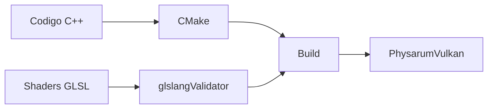

# Instalacion y build

Esta guia se enfoca en `PhysarumVulkan`, que es la version actual del simulador.

## Que vas a compilar

`PhysarumVulkan` es una aplicacion C++20 que usa:

- CMake para configurar el proyecto;
- Vulkan para render y compute;
- GLFW para ventana e input;
- shaders GLSL compilados a SPIR-V;
- OpenCV de forma opcional para mapas y PNG.



## Dependencias en Ubuntu

```bash
sudo apt update
sudo apt install -y build-essential cmake pkg-config
sudo apt install -y libglfw3-dev vulkan-tools vulkan-validationlayers glslang-tools
sudo apt install -y libopencv-dev python3-tk
```

OpenCV es opcional para compilar, pero se necesita para:

- cargar mapas desde imagen;
- exportar atractores a PNG.

Si OpenCV no esta disponible, la aplicacion compila con `PHYSARUM_VULKAN_HAS_OPENCV=0` y esas acciones reportan que OpenCV esta apagado.

## Verificar Vulkan

Antes de compilar, puedes revisar que el sistema vea Vulkan:

```bash
vulkaninfo --summary
```

Si ese comando falla, el problema esta en drivers o instalacion de Vulkan, no en el proyecto.

## Compilar desde cero

Desde la carpeta `PhysarumVulkan`:

```bash
mkdir -p build
cd build
cmake -DCMAKE_BUILD_TYPE=Release ..
cmake --build .
```

El binario queda en:

```bash
PhysarumVulkan/build/PhysarumVulkan
```

## Ejecutar

Desde `PhysarumVulkan/build`:

```bash
./PhysarumVulkan
```

Tambien puedes definir el tamanio inicial de grilla:

```bash
./PhysarumVulkan --grid 200x200
./PhysarumVulkan --grid 512x512
./PhysarumVulkan --grid 1024x1024
./PhysarumVulkan --grid 4000x4000
```

Si no se pasa `--grid`, el valor por defecto es `200x200`.

## Build limpia

Si CMake queda en un estado raro, elimina la carpeta `build` y recompila:

```bash
cd PhysarumVulkan
rm -rf build
mkdir -p build
cd build
cmake -DCMAKE_BUILD_TYPE=Release ..
cmake --build .
```

## Errores comunes

| Error | Causa probable | Solucion |
| --- | --- | --- |
| `glslangValidator not found` | Falta `glslang-tools`. | Instalar `glslang-tools`. |
| `Vulkan not found` | Falta SDK/driver Vulkan. | Instalar paquetes Vulkan y revisar drivers GPU. |
| `GLFW not found` | Falta GLFW o pkg-config. | Instalar `libglfw3-dev pkg-config`. |
| `OpenCV OFF` | OpenCV no fue encontrado. | Instalar `libopencv-dev` y recompilar. |
| Ventana no abre | Driver grafico, Vulkan o entorno de escritorio. | Probar `vulkaninfo --summary`. |
| Grilla enorme falla | Limite de textura de GPU. | Usar grilla menor. |

## Requisitos de Vulkan

La aplicacion crea texturas Vulkan con formato `VK_FORMAT_R8G8B8A8_UNORM`. Si la GPU no soporta el tamanio de grilla solicitado, el programa termina con un error indicando el limite `maxImageDimension2D`.

## Selector de archivos

Para cargar mapas se intenta usar, en este orden:

- `zenity`;
- `kdialog`;
- fallback con `tkinter`.

En escritorios Linux instalados por Snap pueden aparecer variables GTK conflictivas. La aplicacion limpia algunas variables de entorno al iniciar para evitar que el selector de archivos falle por rutas de Snap.

## Build historico SFML

El repositorio conserva proyectos SFML en `Physarum-GUI` y `Unconventional-Comp-Physarum`. Esos directorios sirven como referencia historica, pero la documentacion operativa de esta wiki asume la version Vulkan.

