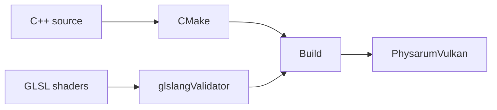

# Installation and Build

Language: [[Espanol|Instalacion-y-build]] | **English**

This guide focuses on `PhysarumVulkan`, the current simulator version.

## What you will build

`PhysarumVulkan` is a C++20 application that uses:

- CMake to configure the project;
- Vulkan for rendering and compute;
- GLFW for windowing and input;
- GLSL shaders compiled to SPIR-V;
- optional OpenCV for maps and PNG export.



## Ubuntu dependencies

```bash
sudo apt update
sudo apt install -y build-essential cmake pkg-config
sudo apt install -y libglfw3-dev vulkan-tools vulkan-validationlayers glslang-tools
sudo apt install -y libopencv-dev python3-tk
```

OpenCV is optional for compilation, but required for:

- image map loading;
- PNG attractor export.

If OpenCV is unavailable, the application builds with `PHYSARUM_VULKAN_HAS_OPENCV=0` and those actions report that OpenCV is disabled.

## Check Vulkan

Before building, check that the system sees Vulkan:

```bash
vulkaninfo --summary
```

If this command fails, the issue is in drivers or Vulkan installation, not in the project.

## Build from scratch

From the `PhysarumVulkan` folder:

```bash
mkdir -p build
cd build
cmake -DCMAKE_BUILD_TYPE=Release ..
cmake --build .
```

The binary is created at:

```bash
PhysarumVulkan/build/PhysarumVulkan
```

## Run

From `PhysarumVulkan/build`:

```bash
./PhysarumVulkan
```

With an initial grid size:

```bash
./PhysarumVulkan --grid 200x200
./PhysarumVulkan --grid 512x512
./PhysarumVulkan --grid 1024x1024
./PhysarumVulkan --grid 4000x4000
```

Default grid size is `200x200`.

## Clean build

If CMake gets into a bad state, delete `build` and configure again:

```bash
cd PhysarumVulkan
rm -rf build
mkdir -p build
cd build
cmake -DCMAKE_BUILD_TYPE=Release ..
cmake --build .
```

## Common errors

| Error | Likely cause | Fix |
| --- | --- | --- |
| `glslangValidator not found` | Missing `glslang-tools`. | Install `glslang-tools`. |
| `Vulkan not found` | Missing Vulkan SDK/driver. | Install Vulkan packages and check GPU drivers. |
| `GLFW not found` | Missing GLFW or pkg-config. | Install `libglfw3-dev pkg-config`. |
| `OpenCV OFF` | OpenCV was not found. | Install `libopencv-dev` and rebuild. |
| Window does not open | Graphics driver, Vulkan, or desktop environment issue. | Run `vulkaninfo --summary`. |
| Huge grid fails | GPU texture limit. | Use a smaller grid. |

## Vulkan requirements

The application creates textures with `VK_FORMAT_R8G8B8A8_UNORM`. If the GPU does not support the requested grid size, the program exits with an error showing `maxImageDimension2D`.

## File picker

For map loading, the application tries:

- `zenity`;
- `kdialog`;
- fallback through `tkinter`.

On Linux desktops installed through Snap, GTK environment variables can conflict. The application sanitizes some variables at startup to avoid file picker failures caused by Snap paths.

## Historical SFML build

The repository keeps SFML projects in `Physarum-GUI` and `Unconventional-Comp-Physarum`. Those folders are historical references; this wiki assumes the Vulkan version for normal operation.

