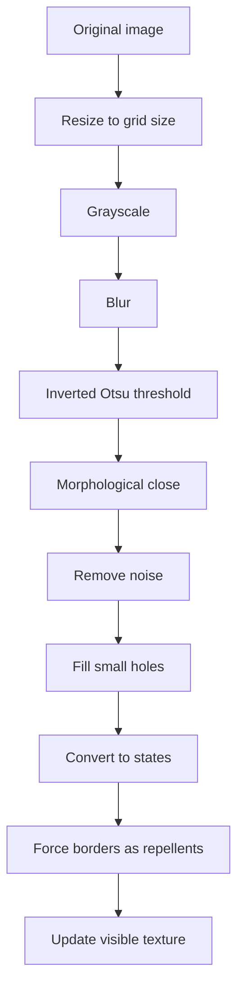

# Map Loading and Export

Language: [[Espanol|Carga-de-mapas-y-exportacion]] | **English**

This page explains how the simulator converts images into cell maps and how it exports attractor results.

## Why load maps

Map loading allows using an image as an initial environment. Areas detected as obstacles become `REPELLENT`; the rest becomes `FREE`.

After loading the map, the user places:

- `START`: origin point;
- `NUTR NO`: destination or point of interest;
- extra `REPELLENT` cells if manual adjustment is needed.

## Loading flow

## Technical pipeline

The **CARGAR MAPA** button opens a file picker. The image is processed with OpenCV when the build includes it.

Steps:

1. read color image;
2. resize to current grid size;
3. convert to grayscale;
4. smooth with Gaussian blur;
5. apply inverted Otsu threshold;
6. apply morphological close;
7. remove small components;
8. fill small interior holes;
9. convert obstacles to state `2`;
10. force external borders to state `2`.

## Image interpretation

The system does not read semantic meaning. It only processes contrast:

- dark areas tend to become obstacles;
- light areas tend to become free space;
- low-contrast images may produce poor maps.

For better results:

- use high-contrast maps;
- avoid noisy backgrounds;
- remove text or irrelevant marks;
- test first with medium grids such as `512x512`.

## Adaptive parameters

| Function | Idea |
| --- | --- |
| `denoiseKernelSize` | Uses a larger kernel for large grids. |
| `minimumObstacleArea` | Removes tiny spots. |
| `maximumHoleArea` | Fills small interior holes. |

## Attractor export

After generating an attractor graph:

- **EXPORT SVG** saves a vector version of the graph.
- **EXPORT PNG** saves a raster image if OpenCV is active.

SVG is recommended for reports because it scales without quality loss.

## Limitations

- Image loading depends on OpenCV.
- PNG export depends on OpenCV.
- Automatic thresholding may require preparing the image first.
- Very large grids increase memory and processing time.
- Exact attractor mode grows quickly with subgrid size.

