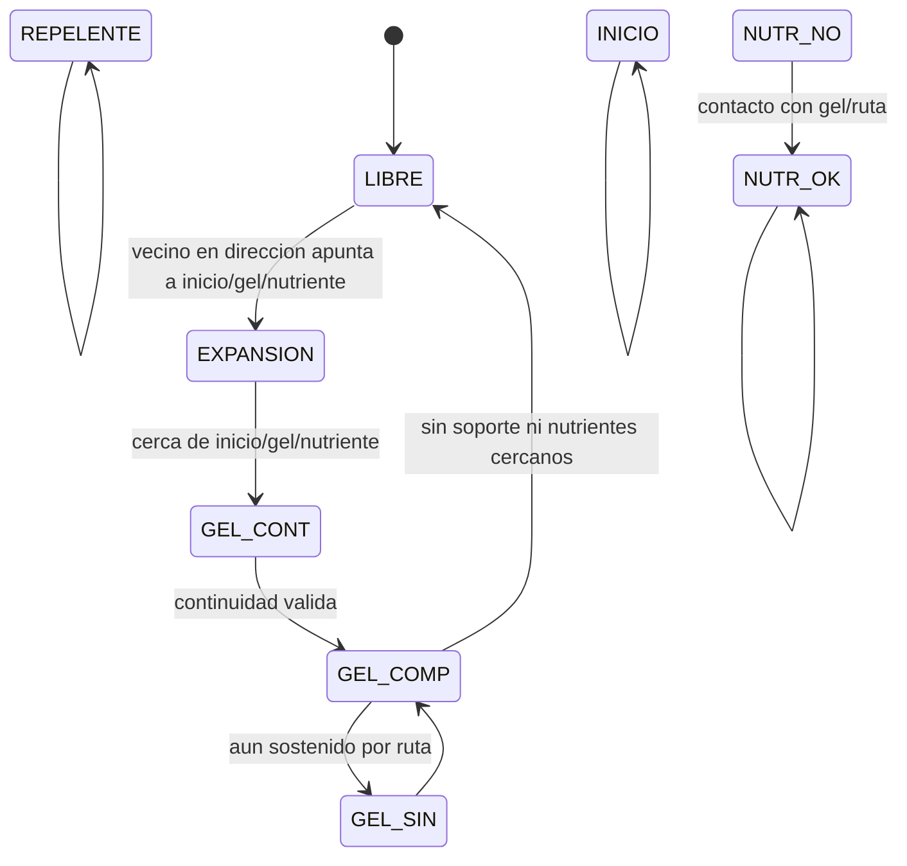
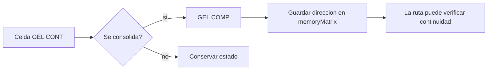

# Modelo del automata

Esta pagina describe el modelo que usa el simulador. Si no conoces automatas celulares, lee primero [[Conceptos-basicos]].

## Definicion informal

El simulador representa el mundo como una grilla. Cada celda tiene un estado. En cada generacion, cada celda observa sus vecinos y decide su nuevo estado.

El comportamiento esta inspirado en *Physarum polycephalum*: primero se expande buscando nutrientes y despues consolida una ruta.

## Definicion formal usada en el proyecto

El automata se puede ver como una tupla:

```text
(Z^2, S, N, f)
```

Donde:

- `Z^2` representa el espacio bidimensional de coordenadas `(x, y)`;
- `S = {0,1,2,3,4,5,6,7,8}` es el conjunto finito de estados;
- `N` es la vecindad de Moore;
- `f` es la funcion local de transicion.

Cada celda se evalua con:

```text
P = (C(x, y, t), N(x, y, t), M(x, y, t))
```

Donde:

- `C` es el estado actual de la celda central;
- `N` son los estados de los vecinos;
- `M` es la memoria de direccion de la celda;
- `t` es la generacion actual.

## Vecindad de Moore

La vecindad de Moore usa las ocho celdas alrededor del centro.

```text
NW  N  NE
 W  C   E
SW  S  SE
```

En codigo, el orden de offsets se conserva desde la implementacion SFML original:

```text
0: W
1: SW
2: S
3: SE
4: E
5: NE
6: N
7: NW
```

## Estados

| Estado | Nombre en UI | Descripcion para usuario nuevo | Rol en la regla |
| --- | --- | --- | --- |
| `0` | `LIBRE` | Espacio disponible. | Puede pasar a expansion. |
| `1` | `NUTR NO` | Nutriente no encontrado. | Destino pendiente. |
| `2` | `REPELENTE` | Obstaculo, pared o limite. | Bloquea crecimiento. |
| `3` | `INICIO` | Origen del Physarum. | Fuente inicial de expansion. |
| `4` | `GEL CONT` | Gel contrayendose o conectando. | Intermedio hacia consolidacion. |
| `5` | `GEL COMP` | Gel compuesto/consolidado. | Parte estable de ruta. |
| `6` | `NUTR OK` | Nutriente encontrado. | Destino alcanzado. |
| `7` | `EXPANSION` | Frente de crecimiento. | Se convierte en gel de contacto. |
| `8` | `GEL SIN` | Gel no compuesto/transitorio. | Regresa a gel compuesto. |

## Ciclo general de ruta



## Reglas resumidas

| Estado actual | Condicion | Siguiente estado |
| --- | --- | --- |
| `0 LIBRE` | Hay `INICIO`, `GEL CONT` o `NUTR OK` en una direccion elegida y la memoria es `0`. | `7 EXPANSION` |
| `1 NUTR NO` | Hay `GEL COMP` o `NUTR OK` alrededor. | `6 NUTR OK` |
| `2 REPELENTE` | Siempre. | `2 REPELENTE` |
| `3 INICIO` | Siempre. | `3 INICIO` |
| `4 GEL CONT` | Hay continuidad hacia `INICIO`, `GEL COMP` o `NUTR OK`, sin libre/expansion alrededor y sin memoria previa. | `5 GEL COMP` |
| `5 GEL COMP` | Ya no esta sostenido por memoria ni por estados clave. | `0 LIBRE` |
| `5 GEL COMP` | No cumple condicion para liberarse. | `8 GEL SIN` |
| `6 NUTR OK` | Siempre. | `6 NUTR OK` |
| `7 EXPANSION` | Hay `INICIO`, `GEL CONT` o `NUTR OK` alrededor. | `4 GEL CONT` |
| `8 GEL SIN` | Siempre. | `5 GEL COMP` |

## Memoria de direccion

La matriz de memoria guarda una direccion de `1` a `8` cuando una celda se consolida. Esa memoria permite revisar si la estructura sigue conectada en generaciones posteriores.



Cuando una celda vuelve a `LIBRE`, su memoria se limpia.

## Esquinas y repelentes imaginarios

Con vecindad de Moore existe un problema: una celda podria atravesar una esquina diagonal aunque dos paredes ortogonales bloqueen el paso. Para evitarlo, la regla agrega una pared imaginaria cuando detecta dos repelentes formando una esquina.

```text
Caso:

R  X
C  R

R = repelente real
C = celda central
X = esquina diagonal tratada como repelente
```

Este ajuste permite representar laberintos, cuevas y mapas con obstaculos sin que el crecimiento escape por diagonales imposibles.

## Pseudocodigo

```text
por cada generacion:
    auxMatrix = physarumMatrix

    para cada celda (x, y):
        vecinos = obtener vecinos Moore
        memoria_vecinos = obtener memoria de vecinos
        aplicar paredes de esquina
        elegir direccion pseudoaleatoria
        evaluar regla de transicion
        escribir cambios en auxMatrix
        registrar region modificada

    physarumMatrix = auxMatrix
    actualizar pixeles de la region modificada
```

## Cuando se considera una ruta terminada

El simulador observa:

- cuantos nutrientes siguen como `NUTR NO`;
- cuantos nutrientes ya son `NUTR OK`;
- cuantas celdas de Physarum siguen activas;
- si la cantidad de gel se estabiliza.

Cuando ya no quedan nutrientes sin encontrar y la estructura se estabiliza durante varias generaciones, la ruta queda marcada como completada.

## Simulacion normal contra atractores

La simulacion normal usa una direccion pseudoaleatoria para simular expansion organica.

La exploracion de atractores usa una direccion determinista basada en el estado. Esto es necesario porque un grafo de atractores necesita que cada configuracion tenga siempre el mismo sucesor.

