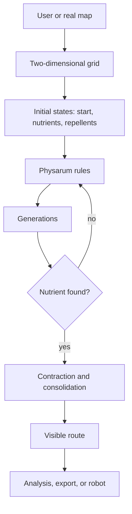

# Project Vision

Language: [[Espanol|Vision-del-proyecto]] | **English**

## Context

Cellular automata are discrete systems made of cells. Each cell keeps a state and evolves through local rules applied to its neighbors.

Even when each rule is local, the complete system can produce emergent behavior. In this project, that behavior is used to study routing, expansion, and monitoring in two-dimensional spaces.

## Biological inspiration

*Physarum polycephalum* is a slime mold that forms networks while searching for food. It is known for solving mazes, finding efficient paths, and adapting to obstacles.

The project translates that idea into software:

## Problem addressed

In automation and monitoring environments, it is not enough to move a robot or execute a task. The system also needs to observe its environment, react to obstacles, and keep a reliable route.

The project proposes a system that can:

- represent an environment as a two-dimensional map;
- place origin, destination, and obstacles;
- generate a route using bio-inspired rules;
- visualize the process in real time;
- serve as a base for a monitoring robot.

## General objective

Implement an automaton capable of determining paths in two-dimensional spaces for real-time route monitoring.

## Project products

| Product | Description | Repository state |
| --- | --- | --- |
| Physarum simulator | Program that calculates routes in a 2D grid through a cellular automaton. | Mainly implemented in `PhysarumVulkan`. |
| Robotic monitoring system | Robot with sensors, communication, and remote control. | Prototypes and tests in `HardwareTests`. |

## Technical scope

The current scope is divided into four lines:

- **Simulation**: visual automaton execution, manual state editing, maps, and route exploration.
- **Analysis**: attractor graph generation to study local automaton dynamics.
- **Rendering and performance**: Vulkan migration for larger grids and partial texture uploads.
- **Hardware**: separate sensor, motor, and communication tests for future robotics integration.

## Complete conceptual flow

## Repository evolution

The repository preserves several stages:

- original SFML prototype;
- SFML/ImGui interface;
- modern Vulkan migration;
- hardware and server tests;
- final document and academic article.

The recommended version for continued simulator development is `PhysarumVulkan`.

