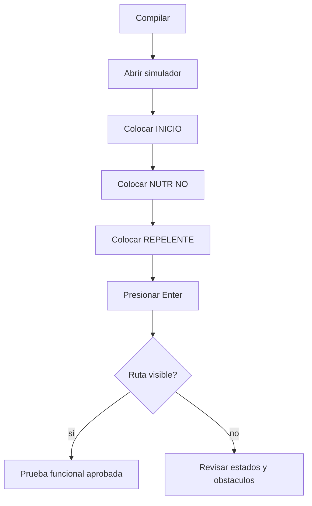

# Pruebas y validacion

Esta pagina resume como validar el proyecto desde tres niveles: build, uso del simulador y pruebas de hardware.

## Pruebas de build

Comandos recomendados:

```bash
cd PhysarumVulkan
mkdir -p build
cd build
cmake -DCMAKE_BUILD_TYPE=Release ..
cmake --build .
```

Si la compilacion falla, revisar primero:

- `glslangValidator`;
- drivers Vulkan;
- GLFW;
- OpenCV si se requieren mapas o PNG;
- version de CMake;
- compilador con soporte C++20.

## Validacion visual del simulador

Despues de compilar `PhysarumVulkan`, valida:

- el canvas aparece en la zona izquierda;
- el menu lateral aparece a la derecha;
- el panel inferior se mantiene visible;
- el clic izquierdo pinta la celda bajo el cursor;
- el zoom se centra sobre el cursor;
- el pan no activa pintado accidentalmente;
- el cambio de grilla pausa la simulacion y reinicia la generacion.

## Casos de aceptacion del simulador

Los LaTeX del Trabajo Terminal documentan pruebas de aceptacion en escenarios pequenos, medianos y complejos. La version actual debe cubrir estos casos:

| Caso | Flujo | Criterio de aceptacion |
| --- | --- | --- |
| Seleccion de estados | Presionar teclas numericas. | Cambia el estado seleccionado y puede pintarse. |
| Colocacion de inicio y nutriente | Seleccionar estado y hacer clic en lienzo. | La celda cambia dentro del area valida. |
| Inicio de simulacion | Presionar `Enter`. | Aumentan generaciones y aparece expansion si hay `INICIO`. |
| Generacion de ruta | Colocar `INICIO` y `NUTR NO`. | El nutriente se encuentra y queda una ruta visible. |
| Cambio de tamanio | Usar `F1` a `F4` o `--grid`. | El lienzo corresponde al tamanio esperado. |
| Carga de mapa | Usar **CARGAR MAPA**. | La imagen se convierte en obstaculos y espacio libre. |
| Escenario complejo | Usar mapas con muchas barreras. | El algoritmo se adapta, aunque tarde mas. |

## Prueba manual recomendada



## Pruebas de mapa

1. Ejecutar con `--grid 512x512`.
2. Cargar una imagen de alto contraste.
3. Verificar que los bordes sean repelentes.
4. Verificar que zonas oscuras sean obstaculos.
5. Colocar inicio y nutriente en zonas libres.
6. Ejecutar simulacion.

## Pruebas de atractores

1. Usar `ATR 2x2`.
2. Presionar **ATRACTORES**.
3. Verificar que aparece ventana de grafo.
4. Exportar SVG.
5. Cambiar a `ATR 3x3`.
6. Verificar que el modo exacto sigue funcionando.
7. Cambiar a mayor que `9` celdas y verificar `MODO APROX`.

## Pruebas de rendimiento

El documento academico observa que el tiempo entre generaciones crece con:

- mayor tamanio de grilla;
- mayor cantidad de obstaculos;
- mapas mas complejos;
- hardware con menos capacidad.

Para comparar cambios de rendimiento, usar siempre:

- mismo tamanio de grilla;
- mismo mapa;
- misma configuracion inicial;
- mismo tipo de build (`Release`);
- misma maquina.

## Pruebas de hardware

En `HardwareTests` hay proyectos CMake con pruebas Google Test para LiDAR, motores y prototipos de robot. Cada subproyecto tiene dependencias distintas, por lo que deben validarse de forma independiente.

Ejemplos de validacion:

- LiDAR responde y entrega lecturas;
- mocks de motores pasan pruebas sin hardware;
- servidores WebSocket aceptan conexiones;
- comandos remotos llegan al componente esperado.

## Riesgos conocidos

- Las rutas de sensores dependen de hardware y SDKs instalados localmente.
- El modo exacto de atractores crece exponencialmente.
- Los mapas con poco contraste pueden producir obstaculos incorrectos.
- Las sesiones Wayland/X11 y el escalado de pantalla pueden afectar el mapeo de input si se modifica el codigo de ventana.
- Las grillas grandes pueden aumentar mucho el costo de evaluacion por generacion.

