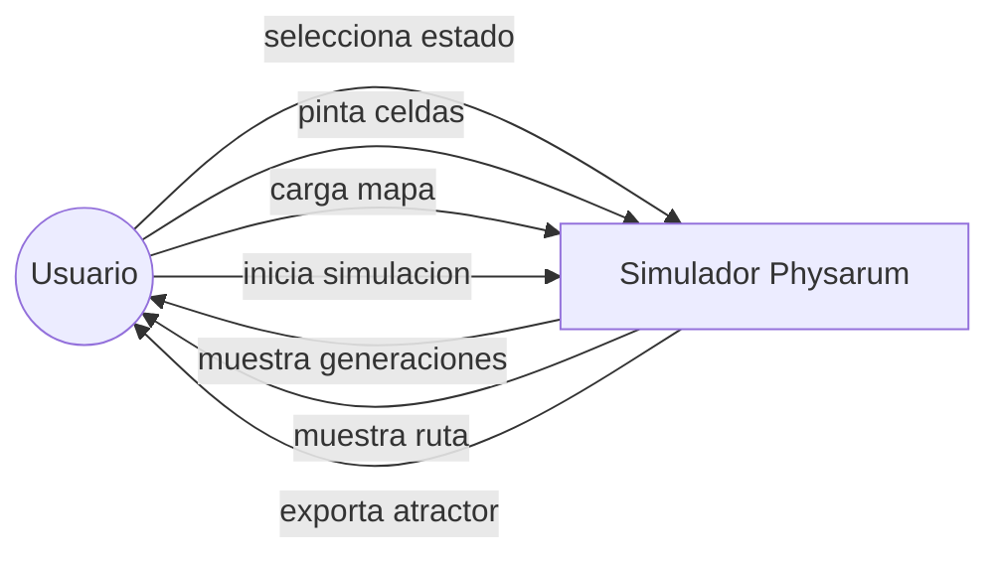
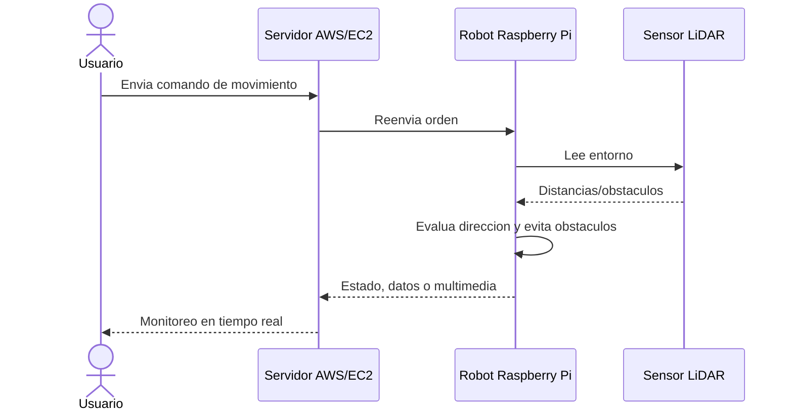

# Requerimientos y casos de uso

Esta pagina resume los requerimientos del Trabajo Terminal y los conecta con el codigo actual.

## Objetivo general

Implementar un automata capaz de determinar trayectos en espacios bidimensionales para monitorear trazando rutas en tiempo real.

## Objetivos especificos

- Disenar un automata basado en *Physarum polycephalum* para determinar trayectos en espacios bidimensionales.
- Implementar la simulacion del automata en C++.
- Implementar el automata en un robot controlado por Raspberry Pi 4.
- Disenar un sistema de monitoreo para visualizar el estado del automata y del robot.
- Realizar pruebas en entorno controlado.
- Realizar pruebas en entorno real.

## Requerimientos funcionales

| ID | Nombre | Descripcion | Estado en el repositorio |
| --- | --- | --- | --- |
| RF1 | Seleccionar | Permitir seleccionar estados con teclado y raton. | Implementado en `PhysarumVulkan`. |
| RF2 | Colocar | Colocar estados iniciales y finales en el lienzo. | Implementado con pintado de celdas. |
| RF3 | Iniciar | Iniciar la simulacion con `Enter`. | Implementado. |
| RF4 | Cargar | Cargar mapa o imagen en el lienzo. | Implementado con OpenCV opcional. |
| RF5 | Visualizar | Mostrar la ruta generada en tiempo real. | Implementado en el render Vulkan. |

## Requerimientos no funcionales

| ID | Nombre | Descripcion | Observacion |
| --- | --- | --- | --- |
| RNF1 | Rendimiento | Responder al inicio de simulacion en menos de 3 segundos para mapas de hasta 1000 nodos. | Depende del tamanio de grilla y hardware. |
| RNF2 | Escalabilidad | Manejar hasta 5000 nodos sin caida mayor al 5%. | La version Vulkan mejora render y upload de textura. |
| RNF3 | Portabilidad | Ejecutarse en Windows 10 y Linux Debian-like. | La version actual esta documentada para Ubuntu; hay proyectos Visual Studio historicos. |
| RNF4 | Facilidad de uso | Ser usable por un usuario novato tras 30 minutos de guia. | La wiki y el menu lateral apoyan este punto. |

## Casos de uso del simulador

## Caso de uso principal: generar ruta

| Campo | Descripcion |
| --- | --- |
| Actor | Usuario del simulador. |
| Precondicion | La aplicacion esta abierta y hay una grilla disponible. |
| Flujo normal | Seleccionar `INICIO`, pintar origen, seleccionar `NUTR NO`, pintar destino, colocar obstaculos si aplica, presionar `Enter`. |
| Resultado esperado | La simulacion se expande, encuentra el nutriente y deja visible la ruta. |
| Excepciones | Si no hay inicio o nutriente, no se obtiene una ruta util. Si el mapa esta cerrado, la expansion no alcanza el destino. |

## Caso de uso del sistema robotico

El documento LaTeX describe un sistema distribuido donde un usuario controla o monitorea un robot mediante una capa de servidor.

## Trazabilidad rapida

| Necesidad | Donde verlo |
| --- | --- |
| Seleccionar y pintar estados | [[Guia-de-uso]] |
| Entender estados y reglas | [[Modelo-del-automata]] |
| Cargar mapas | [[Carga-de-mapas-y-exportacion]] |
| Entender la arquitectura de codigo | [[Arquitectura]] |
| Entender robot y comunicacion | [[Hardware-y-comunicacion]] |
| Validar que funcione | [[Pruebas-y-validacion]] |

