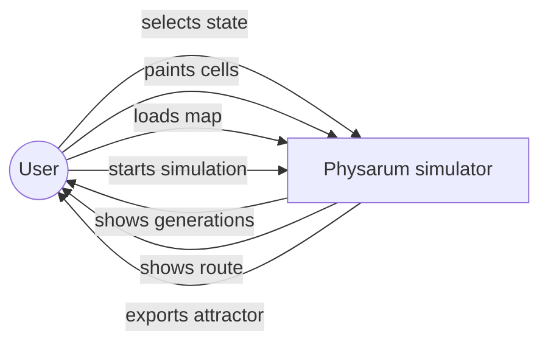
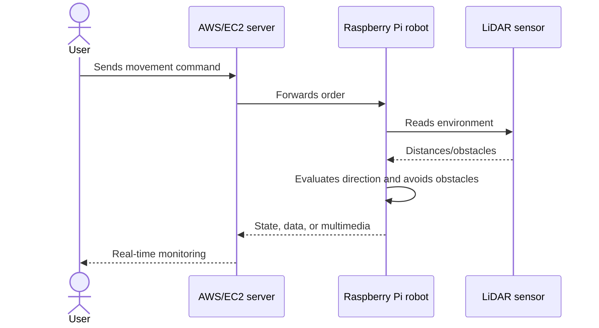

# Requirements and Use Cases

Language: [[Espanol|Requerimientos-y-casos-de-uso]] | **English**

This page summarizes the terminal project requirements and connects them with the current codebase.

## General objective

Implement an automaton capable of determining paths in two-dimensional spaces for real-time route monitoring.

## Specific objectives

- Design an automaton based on *Physarum polycephalum* to determine paths in two-dimensional spaces.
- Implement the automaton simulation in C++.
- Implement the automaton in a Raspberry Pi 4 controlled robot.
- Design a monitoring system to visualize the automaton and robot state.
- Run tests in a controlled environment.
- Run tests in a real environment.

## Functional requirements

| ID | Name | Description | Repository state |
| --- | --- | --- | --- |
| RF1 | Select | Allow the user to select simulator states with keyboard and mouse. | Implemented in `PhysarumVulkan`. |
| RF2 | Place | Place initial and final states on the canvas. | Implemented through cell painting. |
| RF3 | Start | Start the route simulation with `Enter`. | Implemented. |
| RF4 | Load | Load a map or image into the canvas. | Implemented with optional OpenCV. |
| RF5 | Visualize | Show the generated route in real time. | Implemented in Vulkan rendering. |

## Non-functional requirements

| ID | Name | Description | Note |
| --- | --- | --- | --- |
| RNF1 | Performance | Respond to simulation start requests in under 3 seconds for maps up to 1000 nodes. | Depends on grid size and hardware. |
| RNF2 | Scalability | Handle simulations with up to 5000 nodes without more than 5% performance degradation. | The Vulkan version improves render and texture uploads. |
| RNF3 | Portability | Run on Windows 10 and Debian-based Linux systems. | Current docs focus on Ubuntu; historical Visual Studio projects exist. |
| RNF4 | Usability | Be understandable for a novice user after up to 30 minutes of guided use. | This wiki and the side menu support this requirement. |

## Simulator use cases

## Main use case: generate route

| Field | Description |
| --- | --- |
| Actor | Simulator user. |
| Precondition | The application is open and a grid is available. |
| Normal flow | Select `START`, paint origin, select `NUTR NO`, paint destination, place obstacles if needed, press `Enter`. |
| Expected result | The simulation expands, finds the nutrient, and leaves the route visible. |
| Exceptions | If there is no start or nutrient, no useful route is obtained. If the map is closed, expansion cannot reach the destination. |

## Robotic system use case

The LaTeX document describes a distributed system where a user controls or monitors a robot through a server layer.

## Quick traceability

| Need | Where to read |
| --- | --- |
| Select and paint states | [[User-Guide]] |
| Understand states and rules | [[Automaton-Model]] |
| Load maps | [[Map-Loading-and-Export]] |
| Understand code architecture | [[Architecture-English]] |
| Understand robot and communication | [[Hardware-and-Communication]] |
| Validate the project | [[Testing-and-Validation]] |

