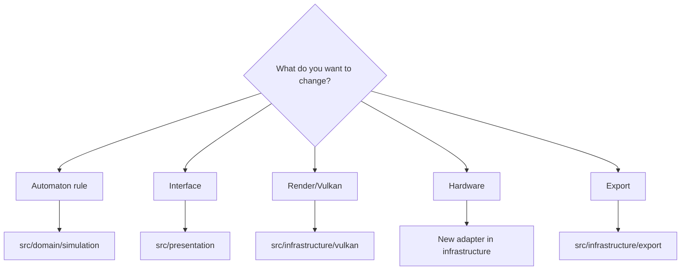
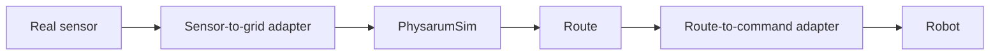

# Roadmap and Maintenance

Language: [[Espanol|Roadmap-y-mantenimiento]] | **English**

This page describes how to continue the project without losing structure.

## Recommended state

The main implementation to maintain is `PhysarumVulkan`. SFML versions should be treated as historical references unless a specific feature needs to be recovered.

## Suggested priorities

1. Consolidate `PhysarumVulkan` as the main implementation.
2. Add unit tests for `PhysarumSim` rules.
3. Separate historical examples from generated binaries and build artifacts.
4. Document datasets or test map images.
5. Create a stable interface for real sensor integration.
6. Automate Linux build in CI.
7. Add reproducible attractor examples.

## Extend without breaking layers

## Practical maintenance rules

- Keep the domain free from Vulkan, GLFW, and hardware dependencies.
- Put adapters in infrastructure.
- Avoid duplicating automaton rules without tests.
- Update this wiki when states or rules change.
- Keep reproducible examples for maps and attractors.
- Build in `Release` before comparing performance.
- Do not mix massive cleanup with functional changes.

## Missing tests

| Area | Suggested test |
| --- | --- |
| States | Given a neighborhood, validate next state. |
| Corners | Confirm two orthogonal repellents block the diagonal. |
| Memory | Verify `memoryMatrix` writes and clears. |
| Maps | Small fixture image converted to expected states. |
| DirtyRegion | Small changes produce partial upload. |
| Attractors | `1x1` and `2x2` produce stable graphs. |
| CLI | `--grid` accepts and rejects values correctly. |

## Technical improvements

- deterministic tests for transitions by state;
- partial upload versus full upload benchmarks;
- profiling for large grids;
- initial configuration export;
- palette import/export;
- scenario presets;
- CI with shader compilation;
- headless mode for domain tests;
- example files for maps and attractors.

## Future robot integration

Recommended integration uses adapters:

This keeps `PhysarumSim` testable without the robot.

## Repository cleanup

The repository contains build artifacts, executables, DLLs, objects, and local build folders. Before a public release, review `.gitignore` and decide what binaries should remain versioned and what should be regenerated.

Normally review:

- `build/` folders;
- `.o`, `.obj` files;
- generated executables;
- LaTeX logs;
- DLLs if no longer needed for distribution;
- IDE caches.

