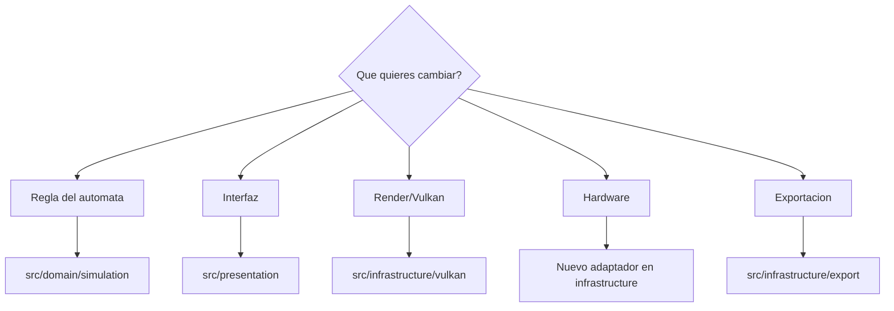
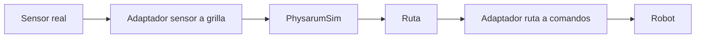

# Roadmap y mantenimiento

Esta pagina describe como continuar el proyecto sin perder estructura.

## Estado recomendado

La implementacion principal a mantener es `PhysarumVulkan`. Las versiones SFML deben tratarse como referencia historica salvo que se decida recuperar una funcionalidad concreta.

## Prioridades sugeridas

1. Consolidar `PhysarumVulkan` como implementacion principal.
2. Agregar pruebas unitarias para reglas de `PhysarumSim`.
3. Separar ejemplos historicos de binarios y artefactos generados.
4. Documentar datasets o imagenes de mapas de prueba.
5. Crear una interfaz estable para integrar sensores reales.
6. Automatizar build en CI para Linux.
7. Agregar ejemplos reproducibles para atractores.

## Como extender sin romper capas

## Mantenimiento del codigo

Reglas practicas:

- mantener el dominio libre de dependencias de Vulkan, GLFW y hardware;
- colocar adaptadores en infraestructura;
- evitar duplicar reglas del automata sin pruebas;
- registrar cambios de estados en esta wiki cuando se modifique la regla;
- conservar ejemplos reproducibles para mapas y atractores;
- compilar en `Release` antes de comparar rendimiento;
- no mezclar limpieza masiva con cambios funcionales.

## Pruebas que hacen falta

| Area | Prueba sugerida |
| --- | --- |
| Estados | Dado un vecindario, validar siguiente estado. |
| Esquinas | Confirmar que dos repelentes ortogonales bloquean diagonal. |
| Memoria | Verificar escritura y limpieza de `memoryMatrix`. |
| Mapas | Imagen fixture pequena convertida a estados esperados. |
| DirtyRegion | Cambios pequenos generan upload parcial. |
| Atractores | `1x1` y `2x2` generan grafo estable. |
| CLI | `--grid` acepta y rechaza valores correctamente. |

## Posibles mejoras tecnicas

- pruebas deterministas para transiciones por estado;
- benchmarks de upload parcial contra upload completo;
- perfiles para grillas grandes;
- exportacion de configuraciones iniciales;
- importacion/exportacion de paletas;
- presets de escenarios;
- CI con compilacion de shaders;
- modo headless para pruebas del dominio;
- archivos de ejemplo para mapas y atractores.

## Integracion futura con robot

La integracion recomendada es por adaptadores:

Asi `PhysarumSim` sigue siendo testeable sin robot.

## Limpieza futura del repositorio

El repositorio contiene artefactos de compilacion, ejecutables, DLLs, objetos y builds locales. Antes de una entrega publica conviene revisar `.gitignore` y decidir que binarios deben permanecer versionados y cuales deben regenerarse.

Archivos que normalmente conviene revisar:

- carpetas `build/`;
- objetos `.o`, `.obj`;
- ejecutables generados;
- logs LaTeX;
- DLLs si ya no son necesarias para distribucion;
- caches de IDE.

## Documentacion

Cuando cambie una regla, estado o flujo principal, actualizar:

- [[Modelo-del-automata]]
- [[Guia-de-uso]]
- [[Arquitectura]]
- [[Pruebas-y-validacion]]

