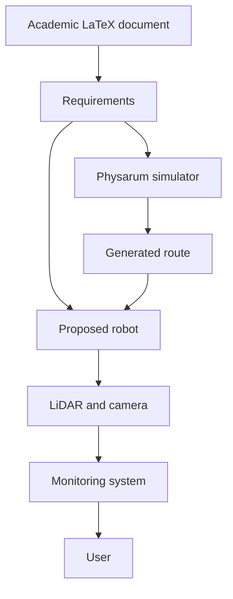
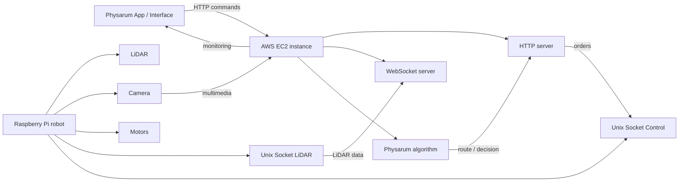
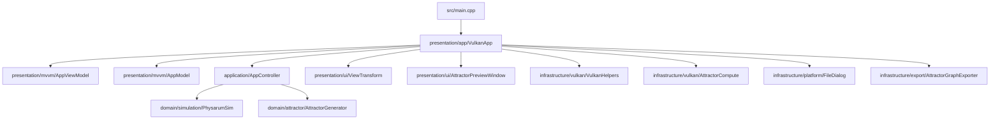
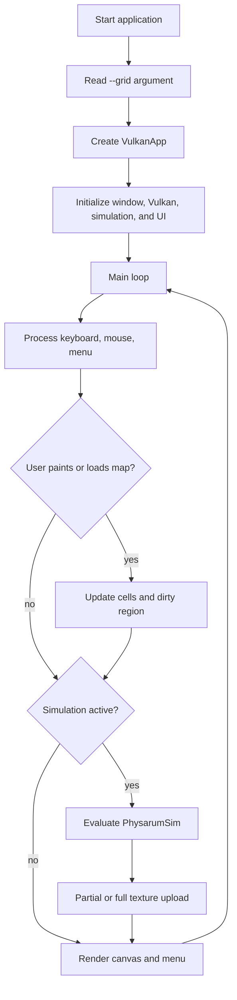
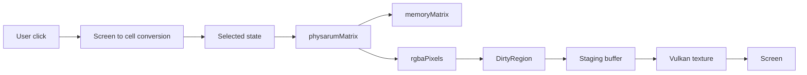
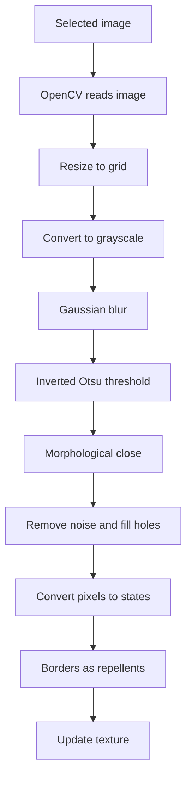
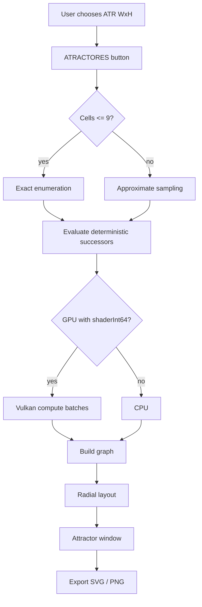

# System Diagrams

Language: [[Espanol|Diagramas-del-sistema]] | **English**

This page groups the main diagrams. They use Mermaid so GitHub Wiki can render them directly.

## Project overview

## Proposed distributed architecture

## Current code architecture

## Simulator execution flow

## Cell data flow

## Map loading flow

## Attractor flow

