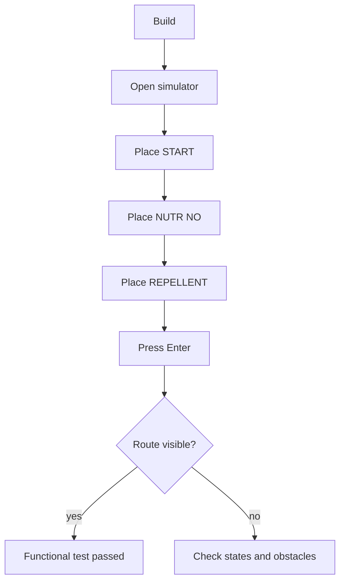

# Testing and Validation

Language: [[Espanol|Pruebas-y-validacion]] | **English**

This page summarizes how to validate the project at three levels: build, simulator use, and hardware tests.

## Build tests

Recommended commands:

```bash
cd PhysarumVulkan
mkdir -p build
cd build
cmake -DCMAKE_BUILD_TYPE=Release ..
cmake --build .
```

If compilation fails, check:

- `glslangValidator`;
- Vulkan drivers;
- GLFW;
- OpenCV if maps or PNG are required;
- CMake version;
- C++20 compiler support.

## Visual validation

After building `PhysarumVulkan`, validate:

- the canvas appears on the left;
- the side menu appears on the right;
- the lower panel remains visible;
- left click paints the cell under the cursor;
- zoom is centered on the cursor;
- pan does not accidentally paint;
- grid change pauses the simulation and resets generation.

## Simulator acceptance cases

The LaTeX documents describe acceptance tests for small, medium, and complex scenarios. The current version should cover:

| Case | Flow | Acceptance criterion |
| --- | --- | --- |
| State selection | Press numeric keys. | Selected state changes and can be painted. |
| Start and nutrient placement | Select state and click canvas. | Cell changes inside valid area. |
| Simulation start | Press `Enter`. | Generations increase and expansion appears if `START` exists. |
| Route generation | Place `START` and `NUTR NO`. | Nutrient is found and route remains visible. |
| Size change | Use `F1` to `F4` or `--grid`. | Canvas matches expected size. |
| Map loading | Use **CARGAR MAPA**. | Image converts into obstacles and free space. |
| Complex scenario | Use maps with many barriers. | Algorithm adapts, although it may take longer. |

## Recommended manual test



## Map tests

1. Run with `--grid 512x512`.
2. Load a high-contrast image.
3. Check that borders are repellents.
4. Check that dark zones become obstacles.
5. Place start and nutrient on free areas.
6. Run the simulation.

## Attractor tests

1. Use `ATR 2x2`.
2. Press **ATRACTORES**.
3. Verify that the graph window appears.
4. Export SVG.
5. Change to `ATR 3x3`.
6. Verify exact mode still works.
7. Change to more than `9` cells and verify `MODO APROX`.

## Performance tests

The academic document observes that generation time grows with:

- larger grids;
- more obstacles;
- more complex maps;
- less powerful hardware.

Compare performance using the same:

- grid size;
- map;
- initial configuration;
- build type (`Release`);
- machine.

## Hardware tests

`HardwareTests` includes CMake projects with Google Test for LiDAR, motors, and robot prototypes. Each subproject has different dependencies and should be validated independently.

## Known risks

- Sensor paths depend on hardware and installed SDKs.
- Exact attractor mode grows exponentially.
- Low-contrast maps can produce wrong obstacles.
- Wayland/X11 sessions and display scaling can affect input mapping if window code changes.
- Large grids can significantly increase generation cost.

