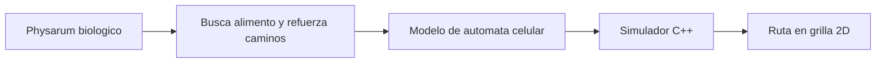
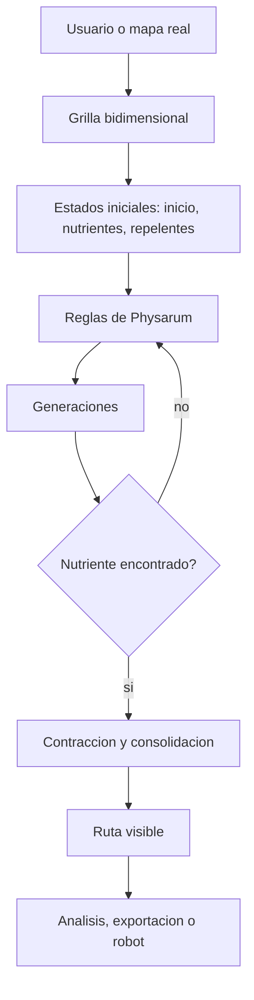

# Vision del proyecto

## Contexto

Los automatas celulares son sistemas discretos compuestos por celdas. Cada celda conserva un estado y evoluciona con base en reglas locales aplicadas sobre sus vecinos.

Aunque cada regla es local, el conjunto completo puede producir comportamiento emergente. En este proyecto ese comportamiento se usa para estudiar rutas, expansion y monitoreo en espacios bidimensionales.

## Inspiracion biologica

*Physarum polycephalum* es un mixomiceto que, en su etapa plasmoidal, forma redes para buscar alimento. Es conocido por resolver laberintos, encontrar rutas eficientes y adaptarse a obstaculos.

El proyecto toma esa idea y la traduce a software:

## Problema que aborda

En entornos de automatizacion y monitoreo, no basta con mover un robot o ejecutar una tarea: tambien se necesita observar el entorno, reaccionar ante obstaculos y mantener una ruta confiable.

El proyecto propone un sistema que pueda:

- representar un entorno como mapa bidimensional;
- colocar origen, destino y obstaculos;
- generar una ruta mediante reglas bioinspiradas;
- visualizar el proceso en tiempo real;
- servir como base para un robot de monitoreo.

## Objetivo general

Implementar un automata capaz de determinar trayectos en espacios bidimensionales para monitorear trazando rutas en tiempo real.

## Productos del proyecto

El Trabajo Terminal plantea dos productos principales:

| Producto | Descripcion | Estado en repositorio |
| --- | --- | --- |
| Simulador Physarum | Programa que calcula rutas en una grilla 2D mediante automata celular. | Implementado principalmente en `PhysarumVulkan`. |
| Sistema de monitoreo robotico | Robot con sensores, comunicacion y control remoto. | Prototipos y pruebas en `HardwareTests`. |

## Alcance tecnico

El alcance actual se divide en cuatro lineas:

- **Simulacion**: ejecucion visual del automata, edicion manual de estados, mapas y exploracion de rutas.
- **Analisis**: generacion de grafos de atractores para estudiar dinamica local del automata.
- **Render y rendimiento**: migracion a Vulkan para manejar grillas mas grandes y uploads parciales.
- **Hardware**: pruebas separadas de sensores, motores y comunicacion para una futura integracion robotica.

## Flujo conceptual completo

## Evolucion del repositorio

El repositorio conserva varias etapas:

- prototipo SFML original;
- interfaz SFML/ImGui;
- migracion moderna a Vulkan;
- pruebas de hardware y servidores;
- documento final y articulo academico.

La version recomendada para continuar el desarrollo del simulador es `PhysarumVulkan`.

## Lecturas relacionadas

- [[Conceptos-basicos]]
- [[Requerimientos-y-casos-de-uso]]
- [[Modelo-del-automata]]
- [[Hardware-y-comunicacion]]

